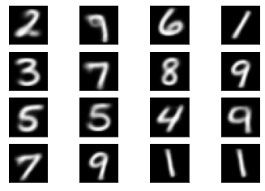
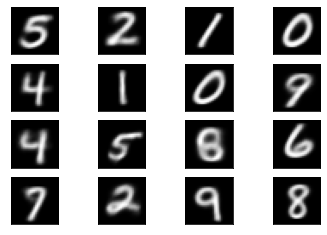

#WEEK 8
Written by Maxime BOURGEOIS

#PART 1: Autoencoder and Denoising Autoencoder on MNIST Dataset

#PART 2 (Exe.18): Colorization of Black and White Images on Labeled Faces in the Wild Dataset

#Deep Autoencoder on MNIST


```python
import numpy as np
import tensorflow as tf

from tensorflow import keras

from tensorflow.keras.layers import Input

from keras.datasets import mnist

import matplotlib.pyplot as plt
```

##Exe. 1: Import the mnist dataset from the keras.datasets

Load it in x train, y train, x test, y test variables. Check the train and test shapes.


```python
(x_train, _), (x_test, _) = mnist.load_data()

print(x_train.shape)
print(x_test.shape)

x_train_0 = plt.imshow(x_train[0])
plt.gray()
plt.show()

```

    Downloading data from https://storage.googleapis.com/tensorflow/tf-keras-datasets/mnist.npz
    11493376/11490434 [==============================] - 0s 0us/step
    (60000, 28, 28)
    (10000, 28, 28)
    


    

    


###Normalize x train and x test


```python
x_train = x_train.astype('float32')
x_test = x_test.astype('float32')

# normalize to range 0-1
x_train = x_train / 255.0
x_test = x_test / 255.0

print(x_train.shape)
print(x_test.shape)
print(x_train[0].shape)
```

    (60000, 28, 28)
    (10000, 28, 28)
    (28, 28)
    

## Exe. 2: Plot some images to see your normalization results


```python
x_train_1 = plt.imshow(x_train[0])
plt.gray()
plt.show()
```


    

    


##Exe. 3: Encoder Model

###Let's define the LATENT SIZE = 32


```python
LATENT_SIZE = 32
```


```python
x_train = x_train.reshape(len(x_train), np.prod(x_train.shape[1:]))
x_test = x_test.reshape(len(x_test), np.prod(x_test.shape[1:]))
```

###Create a encoder model namely encoder

Dense => ReLU => Dropout => Dense => ReLU => Dropout => Dense => ReLU => Dropout => Dense => ReLU => Dropout


```python
encoder = keras.Sequential()

encoder.add(keras.layers.Dense(512, activation ='relu'))
encoder.add(keras.layers.Dropout(0.2))

encoder.add(keras.layers.Dense(128, activation ='relu'))
encoder.add(keras.layers.Dropout(0.2))

encoder.add(keras.layers.Dense(64, activation ='relu'))
encoder.add(keras.layers.Dropout(0.2))

encoder.add(keras.layers.Dense(LATENT_SIZE, activation ='relu'))
encoder.add(keras.layers.Dropout(0.2))

```

##Exe. 4: Create a decoder model namely decoder


```python
decoder = keras.Sequential()

decoder.add(keras.layers.Dense(64, activation ='relu'))
decoder.add(keras.layers.Dropout(0.2))

decoder.add(keras.layers.Dense(128, activation ='relu'))
decoder.add(keras.layers.Dropout(0.2))

decoder.add(keras.layers.Dense(512, activation ='relu'))
decoder.add(keras.layers.Dropout(0.2))

decoder.add(keras.layers.Dense(784, activation='sigmoid'))
```

##Exe. 5: Compile the Model


```python
img = Input(shape=(784,))

latent_vector = encoder(img)
output = decoder(latent_vector)

model = keras.Model(inputs = img, outputs = output)

model.summary()

model.compile("nadam", loss= "binary_crossentropy")
```

    Model: "model"
    _________________________________________________________________
    Layer (type)                 Output Shape              Param #   
    =================================================================
    input_1 (InputLayer)         [(None, 784)]             0         
    _________________________________________________________________
    sequential (Sequential)      (None, 32)                477920    
    _________________________________________________________________
    sequential_1 (Sequential)    (None, 784)               478672    
    =================================================================
    Total params: 956,592
    Trainable params: 956,592
    Non-trainable params: 0
    _________________________________________________________________
    

##Exe. 6 Train the Model


```python
EPOCHS = 60
for epoch in range(EPOCHS):
  print('EPOCH n°', epoch+1)
  model.fit(x_train, x_train)

  rand = x_test[np.random.randint(0, 10000, 16)].reshape((4, 4, 1, 784))

  
  for i in range(4):
    for j in range(4):
      ax = plt.subplot(4, 4, i*4 + 1 + j)
      ax.get_xaxis().set_visible(False)
      ax.get_yaxis().set_visible(False)
      plt.gray()
      imgg = model.predict(rand[i, j]).reshape(28, 28)
      plt.imshow(imgg)

 
  plt.show()
```

    EPOCH n° 1
    1875/1875 [==============================] - 11s 4ms/step - loss: 0.2319
    


    

    


    EPOCH n° 2
    1875/1875 [==============================] - 7s 4ms/step - loss: 0.1800
    


    

    


    EPOCH n° 3
    1875/1875 [==============================] - 7s 4ms/step - loss: 0.1754
    


    

    


    EPOCH n° 4
    1875/1875 [==============================] - 7s 4ms/step - loss: 0.1729
    


    

    


    EPOCH n° 5
    1875/1875 [==============================] - 7s 4ms/step - loss: 0.1712
    


    

    


    EPOCH n° 6
    1875/1875 [==============================] - 7s 4ms/step - loss: 0.1701
    


    

    


    EPOCH n° 7
    1875/1875 [==============================] - 7s 4ms/step - loss: 0.1692
    


    

    


    EPOCH n° 8
    1875/1875 [==============================] - 7s 4ms/step - loss: 0.1683
    


    

    


    EPOCH n° 9
    1875/1875 [==============================] - 7s 4ms/step - loss: 0.1678
    


    

    


    EPOCH n° 10
    1875/1875 [==============================] - 7s 4ms/step - loss: 0.1674
    


    

    


    EPOCH n° 11
    1875/1875 [==============================] - 7s 4ms/step - loss: 0.1672
    


    

    


    EPOCH n° 12
    1875/1875 [==============================] - 8s 4ms/step - loss: 0.1667
    


    

    


    EPOCH n° 13
    1875/1875 [==============================] - 7s 4ms/step - loss: 0.1664
    


    

    


    EPOCH n° 14
    1875/1875 [==============================] - 8s 4ms/step - loss: 0.1663
    


    

    


    EPOCH n° 15
    1875/1875 [==============================] - 8s 4ms/step - loss: 0.1660
    


    

    


    EPOCH n° 16
    1875/1875 [==============================] - 8s 4ms/step - loss: 0.1658
    


    

    


    EPOCH n° 17
    1875/1875 [==============================] - 8s 4ms/step - loss: 0.1657
    


    

    


    EPOCH n° 18
    1875/1875 [==============================] - 8s 4ms/step - loss: 0.1656
    


    

    


    EPOCH n° 19
    1875/1875 [==============================] - 8s 4ms/step - loss: 0.1654
    


    

    


    EPOCH n° 20
    1875/1875 [==============================] - 8s 4ms/step - loss: 0.1653
    


    

    


    EPOCH n° 21
    1875/1875 [==============================] - 8s 4ms/step - loss: 0.1654
    


    

    


    EPOCH n° 22
    1875/1875 [==============================] - 8s 4ms/step - loss: 0.1653
    


    

    


    EPOCH n° 23
    1875/1875 [==============================] - 8s 4ms/step - loss: 0.1649
    


    

    


    EPOCH n° 24
    1875/1875 [==============================] - 8s 4ms/step - loss: 0.1648
    


    

    


    EPOCH n° 25
    1875/1875 [==============================] - 8s 4ms/step - loss: 0.1649
    


    

    


    EPOCH n° 26
    1875/1875 [==============================] - 9s 5ms/step - loss: 0.1648
    


    

    


    EPOCH n° 27
    1875/1875 [==============================] - 8s 4ms/step - loss: 0.1649
    


    

    


    EPOCH n° 28
    1875/1875 [==============================] - 8s 4ms/step - loss: 0.1650
    


    

    


    EPOCH n° 29
    1875/1875 [==============================] - 8s 5ms/step - loss: 0.1648
    


    

    


    EPOCH n° 30
    1875/1875 [==============================] - 8s 4ms/step - loss: 0.1648
    


    

    


    EPOCH n° 31
    1875/1875 [==============================] - 8s 4ms/step - loss: 0.1646
    


    

    


    EPOCH n° 32
    1875/1875 [==============================] - 8s 5ms/step - loss: 0.1646
    


    

    


    EPOCH n° 33
    1875/1875 [==============================] - 8s 4ms/step - loss: 0.1647
    


    

    


    EPOCH n° 34
    1875/1875 [==============================] - 8s 4ms/step - loss: 0.1644
    


    

    


    EPOCH n° 35
    1875/1875 [==============================] - 8s 4ms/step - loss: 0.1647
    


    

    


    EPOCH n° 36
    1875/1875 [==============================] - 8s 5ms/step - loss: 0.1644
    


    

    


    EPOCH n° 37
    1875/1875 [==============================] - 8s 5ms/step - loss: 0.1647
    


    

    


    EPOCH n° 38
    1875/1875 [==============================] - 9s 5ms/step - loss: 0.1642
    


    

    


    EPOCH n° 39
    1875/1875 [==============================] - 8s 5ms/step - loss: 0.1643
    


    

    


    EPOCH n° 40
    1875/1875 [==============================] - 9s 5ms/step - loss: 0.1644
    


    

    


    EPOCH n° 41
    1875/1875 [==============================] - 8s 5ms/step - loss: 0.1646
    


    

    


    EPOCH n° 42
    1875/1875 [==============================] - 9s 5ms/step - loss: 0.1644
    


    

    


    EPOCH n° 43
    1875/1875 [==============================] - 9s 5ms/step - loss: 0.1644
    


    

    


    EPOCH n° 44
    1875/1875 [==============================] - 9s 5ms/step - loss: 0.1644
    


    

    


    EPOCH n° 45
    1875/1875 [==============================] - 9s 5ms/step - loss: 0.1644
    


    

    


    EPOCH n° 46
    1875/1875 [==============================] - 9s 5ms/step - loss: 0.1642
    


    

    


    EPOCH n° 47
    1875/1875 [==============================] - 9s 5ms/step - loss: 0.1643
    


    

    


    EPOCH n° 48
    1875/1875 [==============================] - 9s 5ms/step - loss: 0.1643
    


    

    


    EPOCH n° 49
    1875/1875 [==============================] - 9s 5ms/step - loss: 0.1645
    


    

    


    EPOCH n° 50
    1875/1875 [==============================] - 9s 5ms/step - loss: 0.1643
    


    

    


    EPOCH n° 51
    1875/1875 [==============================] - 9s 5ms/step - loss: 0.1644
    


    

    


    EPOCH n° 52
    1875/1875 [==============================] - 9s 5ms/step - loss: 0.1645
    


    

    


    EPOCH n° 53
    1875/1875 [==============================] - 9s 5ms/step - loss: 0.1644
    


    

    


    EPOCH n° 54
    1875/1875 [==============================] - 9s 5ms/step - loss: 0.1646
    


    

    


    EPOCH n° 55
    1875/1875 [==============================] - 9s 5ms/step - loss: 0.1646
    


    

    


    EPOCH n° 56
    1875/1875 [==============================] - 9s 5ms/step - loss: 0.1646
    


    

    


    EPOCH n° 57
    1875/1875 [==============================] - 9s 5ms/step - loss: 0.1645
    


    

    


    EPOCH n° 58
    1875/1875 [==============================] - 9s 5ms/step - loss: 0.1648
    


    

    


    EPOCH n° 59
    1875/1875 [==============================] - 9s 5ms/step - loss: 0.1647
    


    

    


    EPOCH n° 60
    1875/1875 [==============================] - 9s 5ms/step - loss: 0.1643
    


    

    


###How close is it to the original images?


```python

plt.figure(figsize=(40, 4))
for i in range(10):

    # display original images
    ax = plt.subplot(2, 10, i + 1)
    plt.imshow(x_test[i].reshape(28, 28))
    plt.gray()
    ax.get_xaxis().set_visible(False)
    ax.get_yaxis().set_visible(False)
    
    # display reconstructed images
    ax = plt.subplot(2, 10, 10 + i + 1)

    imgg = model.predict(x_test[i].reshape(1, 784))
    plt.imshow(imgg.reshape(28, 28))
    plt.gray()
    ax.get_xaxis().set_visible(False)
    ax.get_yaxis().set_visible(False)
  
    
plt.show()

```


    

    


#Denoising autoencoder on MNIST

##Exe. 7: Generate corrupted MNIST images (Add noise)

Generate corrupted MNIST images by adding noise with normal dis-
tribution (mean = 0.5 and std= 0.5) to your x train and x test dataset. Fix
the random seed with your student number.


```python
(x_train, _), (x_test, _) = mnist.load_data()

x_train = x_train.astype('float32') / 255.0
x_test = x_test.astype('float32') / 255.0

np.random.seed(703782)

x_train_noisy = x_train + np.random.normal(loc=0.5, scale=0.5, size=x_train.shape)
x_test_noisy = x_test + np.random.normal(loc=0.5, scale=0.5, size=x_test.shape)

print(x_train_noisy.shape)
print(x_test_noisy.shape)
```

    (60000, 28, 28)
    (10000, 28, 28)
    

##Exe. 8: np.clip()

After adding the random generated noises to the x sets, keep only those among 0 and 1 using np.clip()


```python
x_train_noisy = np.clip(x_train_noisy, 0., 1.)
x_test_noisy = np.clip(x_test_noisy, 0., 1.)
```

##Exe. 9: Noisy image plots

Print some of your noisy images to see how they are noisy now.


```python
for i in range(3):

  ax = plt.subplot(1, 3, i+1)

  ax.get_xaxis().set_visible(False)
  ax.get_yaxis().set_visible(False)

  plt.imshow(x_train_noisy[i])


plt.show()
```


    

    


##Exe. 10: Noisy vs Real Image

Check the new noisy data with the previous model. How are the results? How they are close to the real images?


```python
def get_ax(index):
  ax = plt.subplot(3, 3, index+1)
  ax.get_xaxis().set_visible(False)
  ax.get_yaxis().set_visible(False)
  return ax

def plot_noisy_vs_real(data_index):

  ax = get_ax(0)
  plt.title("Noisy Image")
  plt.imshow(x_test_noisy[data_index].reshape(28,28))

  ax = get_ax(1)
  plt.title("Noisy Image Prediction")
  imgg = model.predict(x_test_noisy[data_index].reshape(1, 784))
  plt.imshow(imgg.reshape(28, 28))

  ax = get_ax(2)
  plt.title("Real Image")
  plt.imshow(x_test[data_index].reshape(28, 28))

  plt.show()


plot_noisy_vs_real(0)
plot_noisy_vs_real(1)
plot_noisy_vs_real(2)
```


    

    


    

    


    

    


**Conclusion : Predictions for noisy images are very bad.**

## Exe. 11: New encoder Model 

The model is as following:

Input(Inputshape) => Conv2d(32) => Conv2d(64) => Flatten => Dense(Latent vector size)


```python
print(x_train[0].shape)
print(x_test[0].shape)
print(x_train_noisy[0].shape)
print(x_test_noisy[0].shape)
```

    (28, 28)
    (28, 28)
    (28, 28)
    (28, 28)
    

We need a shape like (28, 28, 1) and not (28, 28)


```python
def resize_img(data):
  image_size = data.shape[1]
  data = np.reshape(data, [-1, image_size, image_size, 1])
  return data

x_train = resize_img(x_train)
x_test = resize_img(x_test)

x_train_noisy = resize_img(x_train_noisy)
x_test_noisy = resize_img(x_test_noisy)

print(x_train[0].shape)
print(x_test[0].shape)
print(x_train_noisy[0].shape)
print(x_test_noisy[0].shape)

```

    (28, 28, 1)
    (28, 28, 1)
    (28, 28, 1)
    (28, 28, 1)
    


```python
LATENT_SIZE = 16
```


```python
encoder = keras.Sequential()

encoder.add(keras.layers.Input(shape=(28, 28, 1)))
encoder.add(keras.layers.Conv2D(32, (3, 3), activation='relu', padding='same', strides=2))
encoder.add(keras.layers.Conv2D(64, (3, 3), activation='relu', padding='same', strides=2))
      
encoder.add(keras.layers.Flatten())

encoder.add(keras.layers.Dense(LATENT_SIZE, activation='relu')) 

```

##Exe. 12: Build decoder model, based on the following model:


Input(latent size) => Dense(28 * 28 * 1) => Conv2DTranspose(64) =>
 Conv2DTranspose(32) => Conv2DTranspose => Activation('sigmoid')


```python
decoder = keras.Sequential()

#decoder.add(keras.layers.Input(shape=(LATENT_SIZE,)))


decoder.add(keras.layers.Dense(784, activation='relu'))

decoder.add(keras.layers.Reshape(target_shape=(28, 28, 1)))

decoder.add(keras.layers.Conv2DTranspose(64, kernel_size=(3, 3), activation='relu', padding='same', strides=1))

decoder.add(keras.layers.Conv2DTranspose(32, kernel_size=(3, 3), activation='relu', padding='same', strides=1))

decoder.add(keras.layers.Conv2DTranspose(1, kernel_size=(3, 3), activation='sigmoid', padding='same'))

```

##Exe. 13: Make the final model including the encoder and decoder models


```python
input = Input(shape=(28 , 28, 1))
latent_vector = encoder(input)

output = decoder(latent_vector)
print(output.shape)

autoencoder = keras.Model(inputs=input, outputs = output, name ='autoencoder')

encoder.summary()
decoder.summary()
autoencoder.summary()
```

    (None, 28, 28, 1)
    Model: "sequential_2"
    _________________________________________________________________
    Layer (type)                 Output Shape              Param #   
    =================================================================
    conv2d (Conv2D)              (None, 14, 14, 32)        320       
    _________________________________________________________________
    conv2d_1 (Conv2D)            (None, 7, 7, 64)          18496     
    _________________________________________________________________
    flatten (Flatten)            (None, 3136)              0         
    _________________________________________________________________
    dense_8 (Dense)              (None, 16)                50192     
    =================================================================
    Total params: 69,008
    Trainable params: 69,008
    Non-trainable params: 0
    _________________________________________________________________
    Model: "sequential_3"
    _________________________________________________________________
    Layer (type)                 Output Shape              Param #   
    =================================================================
    dense_9 (Dense)              (None, 784)               13328     
    _________________________________________________________________
    reshape (Reshape)            (None, 28, 28, 1)         0         
    _________________________________________________________________
    conv2d_transpose (Conv2DTran (None, 28, 28, 64)        640       
    _________________________________________________________________
    conv2d_transpose_1 (Conv2DTr (None, 28, 28, 32)        18464     
    _________________________________________________________________
    conv2d_transpose_2 (Conv2DTr (None, 28, 28, 1)         289       
    =================================================================
    Total params: 32,721
    Trainable params: 32,721
    Non-trainable params: 0
    _________________________________________________________________
    Model: "autoencoder"
    _________________________________________________________________
    Layer (type)                 Output Shape              Param #   
    =================================================================
    input_3 (InputLayer)         [(None, 28, 28, 1)]       0         
    _________________________________________________________________
    sequential_2 (Sequential)    (None, 16)                69008     
    _________________________________________________________________
    sequential_3 (Sequential)    (None, 28, 28, 1)         32721     
    =================================================================
    Total params: 101,729
    Trainable params: 101,729
    Non-trainable params: 0
    _________________________________________________________________
    

## Exe. 14: Compile the model 


using two classical 'mse' loss function and 'adam' optimiser


```python
autoencoder.compile("adam", loss= "mse")
```

## Exe. 15: Now train the autoencoder. Notice that the to be trained data
here is x train noisy, while the exact data is x train. It is the same for the
test data set:


```python
autoencoder.fit(x_train_noisy, x_train, validation_data=(x_test_noisy, x_test), epochs =30, batch_size = 128)
```

    Epoch 1/30
    469/469 [==============================] - 36s 14ms/step - loss: 0.0833 - val_loss: 0.0351
    Epoch 2/30
    469/469 [==============================] - 6s 12ms/step - loss: 0.0336 - val_loss: 0.0299
    Epoch 3/30
    469/469 [==============================] - 6s 12ms/step - loss: 0.0295 - val_loss: 0.0279
    Epoch 4/30
    469/469 [==============================] - 6s 12ms/step - loss: 0.0279 - val_loss: 0.0269
    Epoch 5/30
    469/469 [==============================] - 6s 13ms/step - loss: 0.0269 - val_loss: 0.0259
    Epoch 6/30
    469/469 [==============================] - 6s 12ms/step - loss: 0.0262 - val_loss: 0.0254
    Epoch 7/30
    469/469 [==============================] - 6s 13ms/step - loss: 0.0255 - val_loss: 0.0252
    Epoch 8/30
    469/469 [==============================] - 6s 12ms/step - loss: 0.0251 - val_loss: 0.0246
    Epoch 9/30
    469/469 [==============================] - 6s 12ms/step - loss: 0.0247 - val_loss: 0.0242
    Epoch 10/30
    469/469 [==============================] - 6s 12ms/step - loss: 0.0243 - val_loss: 0.0239
    Epoch 11/30
    469/469 [==============================] - 6s 12ms/step - loss: 0.0240 - val_loss: 0.0237
    Epoch 12/30
    469/469 [==============================] - 6s 12ms/step - loss: 0.0237 - val_loss: 0.0237
    Epoch 13/30
    469/469 [==============================] - 6s 12ms/step - loss: 0.0234 - val_loss: 0.0235
    Epoch 14/30
    469/469 [==============================] - 6s 13ms/step - loss: 0.0233 - val_loss: 0.0231
    Epoch 15/30
    469/469 [==============================] - 6s 12ms/step - loss: 0.0230 - val_loss: 0.0229
    Epoch 16/30
    469/469 [==============================] - 6s 13ms/step - loss: 0.0229 - val_loss: 0.0228
    Epoch 17/30
    469/469 [==============================] - 6s 12ms/step - loss: 0.0226 - val_loss: 0.0226
    Epoch 18/30
    469/469 [==============================] - 6s 13ms/step - loss: 0.0224 - val_loss: 0.0225
    Epoch 19/30
    469/469 [==============================] - 6s 12ms/step - loss: 0.0223 - val_loss: 0.0222
    Epoch 20/30
    469/469 [==============================] - 6s 12ms/step - loss: 0.0222 - val_loss: 0.0223
    Epoch 21/30
    469/469 [==============================] - 6s 12ms/step - loss: 0.0219 - val_loss: 0.0220
    Epoch 22/30
    469/469 [==============================] - 6s 13ms/step - loss: 0.0218 - val_loss: 0.0220
    Epoch 23/30
    469/469 [==============================] - 6s 13ms/step - loss: 0.0217 - val_loss: 0.0219
    Epoch 24/30
    469/469 [==============================] - 6s 12ms/step - loss: 0.0216 - val_loss: 0.0218
    Epoch 25/30
    469/469 [==============================] - 6s 13ms/step - loss: 0.0214 - val_loss: 0.0216
    Epoch 26/30
    469/469 [==============================] - 6s 13ms/step - loss: 0.0213 - val_loss: 0.0215
    Epoch 27/30
    469/469 [==============================] - 6s 13ms/step - loss: 0.0212 - val_loss: 0.0216
    Epoch 28/30
    469/469 [==============================] - 6s 13ms/step - loss: 0.0210 - val_loss: 0.0213
    Epoch 29/30
    469/469 [==============================] - 6s 13ms/step - loss: 0.0210 - val_loss: 0.0214
    Epoch 30/30
    469/469 [==============================] - 6s 13ms/step - loss: 0.0209 - val_loss: 0.0212
    


    <tensorflow.python.keras.callbacks.History at 0x7f0790093bd0>


## Exe. 16: predict the x test noisy using the trained autoencoder model.


```python
predicted = autoencoder.predict(x_test_noisy)
```

##Exe. 17: Get some of the x test, x test noisy and predicted x test noisy
from the trained model and show compare them in dierent gures.


```python
def get_ax(index):
  ax = plt.subplot(3, 3, index+1)
  ax.get_xaxis().set_visible(False)
  ax.get_yaxis().set_visible(False)
  return ax

def plot_noisy_vs_real(data_index):

  ax = get_ax(0)
  plt.title("Noisy Image")
  plt.imshow(x_test_noisy[data_index].reshape(28, 28))

  ax = get_ax(1)
  plt.title("Noisy Image Prediction")
  plt.imshow(predicted[data_index].reshape(28, 28))

  ax = get_ax(2)
  plt.title("Real Image")
  plt.imshow(x_test[data_index].reshape(28, 28))

  plt.show()


plot_noisy_vs_real(0)
plot_noisy_vs_real(1)
plot_noisy_vs_real(2)
```


    

    


    

    


    

    


#Exe. 18: Implement an encoder decoder on Labeled Faces in the Wild dataset

###Import Libraries


```python
from sklearn.datasets import fetch_lfw_people
from sklearn.model_selection import train_test_split
import numpy as np
import matplotlib.pyplot as plt

import tensorflow as tf
from tensorflow import keras

from keras.layers import Conv2D, Dense, Flatten, Conv2DTranspose, Input, Reshape
from keras import backend
```

###Load Data


```python

def load_data():

    global training_data, testing_data

    lfw_people = fetch_lfw_people(min_faces_per_person=1, resize=0.7, color=True)

     

    h = lfw_people.images.shape[1]
    w = lfw_people.images.shape[2]
    d = lfw_people.images.shape[3]


    xs = lfw_people.data
    ys = lfw_people.target

    x_train, x_test, y_train, y_test = train_test_split(xs, ys, test_size=0.2)

    return (x_train, x_test, y_train, y_test, h, w, d)


```

###Check Data Shape


```python
x_train, x_test, y_train, y_test, h, w, d = load_data()

print(x_train)
print(x_train.shape)
print(h)
print(w)
print(d)
```

    [[ 40.  49.  28. ... 205. 204. 195.]
     [120. 120. 110. ...  68.  75.  78.]
     [ 41.  39.  35. ...  30.  32.  28.]
     ...
     [ 96.  85. 124. ...  72.  34.   9.]
     [ 62.  36.  24. ... 157. 130. 140.]
     [ 84.  67.  67. ...  47.  34.  44.]]
    (10586, 16965)
    87
    65
    3
    

###Get Gray Dataset


```python
reshape_before_gray_train = np.asarray(tf.reshape(x_train, [x_train.shape[0], h, w, d]))
x_train_gray = np.array(tf.image.rgb_to_grayscale(reshape_before_gray_train))

reshape_before_gray_test = np.asarray(tf.reshape(x_test, [x_test.shape[0], h, w, d]))
x_test_gray = np.array(tf.image.rgb_to_grayscale(reshape_before_gray_test))

```

###Scale Data


```python
x_train = x_train.astype('float32')/255.0
x_test = x_test.astype('float32')/255.0

x_train_gray = x_train_gray.astype('float32')/255.0
x_test_gray = x_test_gray.astype('float32')/255.0
```

### Resize Data


```python
def resize_data(x, size, deph):
  x = tf.reshape(x, [x.shape[0], h, w, deph])
  x = tf.image.resize(images=x, size=size, preserve_aspect_ratio=False)

  return x


x_train = np.array(resize_data(x_train, [56,56], 3))
x_test = np.array(resize_data(x_test, [56,56], 3))

x_train_gray = np.array(resize_data(x_train_gray, [56,56], 1))
x_test_gray = np.array(resize_data(x_test_gray, [56,56], 1))

```

###Plot RGB Image


```python
plt.imshow(x_train[0].reshape(56,56,3))
plt.axis('off')
plt.show()
print(x_train[0].shape)
```


    

    


    (56, 56, 3)
    

###Plot Gray Image


```python
plt.imshow(x_train_gray[0].reshape(56, 56))
plt.gray()
plt.axis('off')
plt.show()

print(x_train_gray[0].shape)

```


    

    


    (56, 56, 1)
    

###LATENT_SIZE Definition


```python
LATENT_SIZE = 256
kernel_size=(3, 3)
```

###Encoder Model


```python
encoder = keras.Sequential()

encoder.add(keras.layers.Input(shape=(56, 56, 1)))

encoder.add(keras.layers.Conv2D(64, kernel_size, activation='relu', padding='same', strides=2))
encoder.add(keras.layers.Conv2D(128, kernel_size, activation='relu', padding='same', strides=2))
encoder.add(keras.layers.Conv2D(256, kernel_size, activation='relu', padding='same', strides=2))

encoder.add(keras.layers.Flatten())

encoder.add(keras.layers.Dense(LATENT_SIZE, activation='relu'))

```

###Decoder Model


```python
decoder = keras.Sequential()

decoder.add(keras.layers.Input(shape=(LATENT_SIZE,)))

decoder.add(keras.layers.Dense(12544, activation='relu'))
decoder.add(keras.layers.Reshape(target_shape=(7, 7, 256)))


decoder.add(keras.layers.Conv2DTranspose(256, kernel_size=kernel_size, activation='relu', padding='same', strides=2))
decoder.add(keras.layers.Conv2DTranspose(128, kernel_size=kernel_size, activation='relu', padding='same', strides=2))
decoder.add(keras.layers.Conv2DTranspose(64, kernel_size=kernel_size, activation='relu', padding='same', strides=2))

decoder.add(keras.layers.Conv2DTranspose(3, kernel_size=kernel_size, activation='sigmoid', padding='same'))


```

###AutoEncoder Model


```python
input = Input(shape=(56,56, 1))
latent_vector = encoder(input)

output = decoder(latent_vector)
print(output.shape)

autoencoder = keras.Model(inputs=input, outputs = output, name ='autoencoder')

encoder.summary()
decoder.summary()
autoencoder.summary()
```

    (None, 56, 56, 3)
    Model: "sequential_10"
    _________________________________________________________________
    Layer (type)                 Output Shape              Param #   
    =================================================================
    conv2d_15 (Conv2D)           (None, 28, 28, 64)        640       
    _________________________________________________________________
    conv2d_16 (Conv2D)           (None, 14, 14, 128)       73856     
    _________________________________________________________________
    conv2d_17 (Conv2D)           (None, 7, 7, 256)         295168    
    _________________________________________________________________
    flatten_5 (Flatten)          (None, 12544)             0         
    _________________________________________________________________
    dense_10 (Dense)             (None, 256)               3211520   
    =================================================================
    Total params: 3,581,184
    Trainable params: 3,581,184
    Non-trainable params: 0
    _________________________________________________________________
    Model: "sequential_11"
    _________________________________________________________________
    Layer (type)                 Output Shape              Param #   
    =================================================================
    dense_11 (Dense)             (None, 12544)             3223808   
    _________________________________________________________________
    reshape_5 (Reshape)          (None, 7, 7, 256)         0         
    _________________________________________________________________
    conv2d_transpose_20 (Conv2DT (None, 14, 14, 256)       590080    
    _________________________________________________________________
    conv2d_transpose_21 (Conv2DT (None, 28, 28, 128)       295040    
    _________________________________________________________________
    conv2d_transpose_22 (Conv2DT (None, 56, 56, 64)        73792     
    _________________________________________________________________
    conv2d_transpose_23 (Conv2DT (None, 56, 56, 3)         1731      
    =================================================================
    Total params: 4,184,451
    Trainable params: 4,184,451
    Non-trainable params: 0
    _________________________________________________________________
    Model: "autoencoder"
    _________________________________________________________________
    Layer (type)                 Output Shape              Param #   
    =================================================================
    input_18 (InputLayer)        [(None, 56, 56, 1)]       0         
    _________________________________________________________________
    sequential_10 (Sequential)   (None, 256)               3581184   
    _________________________________________________________________
    sequential_11 (Sequential)   (None, 56, 56, 3)         4184451   
    =================================================================
    Total params: 7,765,635
    Trainable params: 7,765,635
    Non-trainable params: 0
    _________________________________________________________________
    

###Compile the Model


```python
autoencoder.compile(optimizer='adam', loss='mse')
```

###Fit the Model


```python
autoencoder.fit(x_train_gray, 
                x_train, 
                validation_data =(x_test_gray, x_test), 
                epochs = 200, 
                batch_size = 128)
```

    Epoch 1/200
    83/83 [==============================] - 5s 52ms/step - loss: 0.0387 - val_loss: 0.0175
    Epoch 2/200
    83/83 [==============================] - 4s 50ms/step - loss: 0.0159 - val_loss: 0.0115
    Epoch 3/200
    83/83 [==============================] - 4s 50ms/step - loss: 0.0108 - val_loss: 0.0096
    Epoch 4/200
    83/83 [==============================] - 4s 50ms/step - loss: 0.0089 - val_loss: 0.0078
    Epoch 5/200
    83/83 [==============================] - 4s 50ms/step - loss: 0.0076 - val_loss: 0.0077
    Epoch 6/200
    83/83 [==============================] - 4s 50ms/step - loss: 0.0069 - val_loss: 0.0064
    Epoch 7/200
    83/83 [==============================] - 4s 50ms/step - loss: 0.0063 - val_loss: 0.0061
    Epoch 8/200
    83/83 [==============================] - 4s 50ms/step - loss: 0.0060 - val_loss: 0.0059
    Epoch 9/200
    83/83 [==============================] - 4s 50ms/step - loss: 0.0056 - val_loss: 0.0059
    Epoch 10/200
    83/83 [==============================] - 4s 50ms/step - loss: 0.0054 - val_loss: 0.0054
    Epoch 11/200
    83/83 [==============================] - 4s 50ms/step - loss: 0.0050 - val_loss: 0.0051
    Epoch 12/200
    83/83 [==============================] - 4s 50ms/step - loss: 0.0049 - val_loss: 0.0050
    Epoch 13/200
    83/83 [==============================] - 4s 50ms/step - loss: 0.0047 - val_loss: 0.0051
    Epoch 14/200
    83/83 [==============================] - 4s 50ms/step - loss: 0.0046 - val_loss: 0.0047
    Epoch 15/200
    83/83 [==============================] - 4s 50ms/step - loss: 0.0045 - val_loss: 0.0047
    Epoch 16/200
    83/83 [==============================] - 4s 49ms/step - loss: 0.0044 - val_loss: 0.0046
    Epoch 17/200
    83/83 [==============================] - 4s 50ms/step - loss: 0.0041 - val_loss: 0.0047
    Epoch 18/200
    83/83 [==============================] - 4s 50ms/step - loss: 0.0043 - val_loss: 0.0045
    Epoch 19/200
    83/83 [==============================] - 4s 50ms/step - loss: 0.0040 - val_loss: 0.0046
    Epoch 20/200
    83/83 [==============================] - 4s 50ms/step - loss: 0.0038 - val_loss: 0.0045
    Epoch 21/200
    83/83 [==============================] - 4s 50ms/step - loss: 0.0038 - val_loss: 0.0046
    Epoch 22/200
    83/83 [==============================] - 4s 50ms/step - loss: 0.0036 - val_loss: 0.0047
    Epoch 23/200
    83/83 [==============================] - 4s 50ms/step - loss: 0.0035 - val_loss: 0.0046
    Epoch 24/200
    83/83 [==============================] - 4s 50ms/step - loss: 0.0035 - val_loss: 0.0044
    Epoch 25/200
    83/83 [==============================] - 4s 50ms/step - loss: 0.0035 - val_loss: 0.0045
    Epoch 26/200
    83/83 [==============================] - 4s 50ms/step - loss: 0.0033 - val_loss: 0.0044
    Epoch 27/200
    83/83 [==============================] - 4s 50ms/step - loss: 0.0032 - val_loss: 0.0046
    Epoch 28/200
    83/83 [==============================] - 4s 50ms/step - loss: 0.0031 - val_loss: 0.0043
    Epoch 29/200
    83/83 [==============================] - 4s 50ms/step - loss: 0.0030 - val_loss: 0.0043
    Epoch 30/200
    83/83 [==============================] - 4s 50ms/step - loss: 0.0030 - val_loss: 0.0044
    Epoch 31/200
    83/83 [==============================] - 4s 50ms/step - loss: 0.0030 - val_loss: 0.0043
    Epoch 32/200
    83/83 [==============================] - 4s 50ms/step - loss: 0.0028 - val_loss: 0.0043
    Epoch 33/200
    83/83 [==============================] - 4s 50ms/step - loss: 0.0028 - val_loss: 0.0043
    Epoch 34/200
    83/83 [==============================] - 4s 50ms/step - loss: 0.0028 - val_loss: 0.0043
    Epoch 35/200
    83/83 [==============================] - 4s 50ms/step - loss: 0.0027 - val_loss: 0.0043
    Epoch 36/200
    83/83 [==============================] - 4s 50ms/step - loss: 0.0026 - val_loss: 0.0043
    Epoch 37/200
    83/83 [==============================] - 4s 50ms/step - loss: 0.0025 - val_loss: 0.0043
    Epoch 38/200
    83/83 [==============================] - 4s 50ms/step - loss: 0.0025 - val_loss: 0.0043
    Epoch 39/200
    83/83 [==============================] - 4s 50ms/step - loss: 0.0025 - val_loss: 0.0046
    Epoch 40/200
    83/83 [==============================] - 4s 50ms/step - loss: 0.0024 - val_loss: 0.0044
    Epoch 41/200
    83/83 [==============================] - 4s 50ms/step - loss: 0.0024 - val_loss: 0.0043
    Epoch 42/200
    83/83 [==============================] - 4s 50ms/step - loss: 0.0023 - val_loss: 0.0043
    Epoch 43/200
    83/83 [==============================] - 4s 50ms/step - loss: 0.0023 - val_loss: 0.0044
    Epoch 44/200
    83/83 [==============================] - 4s 50ms/step - loss: 0.0023 - val_loss: 0.0043
    Epoch 45/200
    83/83 [==============================] - 4s 51ms/step - loss: 0.0022 - val_loss: 0.0043
    Epoch 46/200
    83/83 [==============================] - 4s 51ms/step - loss: 0.0021 - val_loss: 0.0044
    Epoch 47/200
    83/83 [==============================] - 4s 51ms/step - loss: 0.0021 - val_loss: 0.0043
    Epoch 48/200
    83/83 [==============================] - 4s 50ms/step - loss: 0.0022 - val_loss: 0.0043
    Epoch 49/200
    83/83 [==============================] - 4s 50ms/step - loss: 0.0020 - val_loss: 0.0043
    Epoch 50/200
    83/83 [==============================] - 4s 50ms/step - loss: 0.0020 - val_loss: 0.0045
    Epoch 51/200
    83/83 [==============================] - 4s 50ms/step - loss: 0.0020 - val_loss: 0.0044
    Epoch 52/200
    83/83 [==============================] - 4s 50ms/step - loss: 0.0020 - val_loss: 0.0044
    Epoch 53/200
    83/83 [==============================] - 4s 50ms/step - loss: 0.0019 - val_loss: 0.0044
    Epoch 54/200
    83/83 [==============================] - 4s 50ms/step - loss: 0.0019 - val_loss: 0.0044
    Epoch 55/200
    83/83 [==============================] - 4s 50ms/step - loss: 0.0019 - val_loss: 0.0045
    Epoch 56/200
    83/83 [==============================] - 4s 50ms/step - loss: 0.0019 - val_loss: 0.0044
    Epoch 57/200
    83/83 [==============================] - 4s 50ms/step - loss: 0.0019 - val_loss: 0.0045
    Epoch 58/200
    83/83 [==============================] - 4s 50ms/step - loss: 0.0019 - val_loss: 0.0044
    Epoch 59/200
    83/83 [==============================] - 4s 50ms/step - loss: 0.0019 - val_loss: 0.0044
    Epoch 60/200
    83/83 [==============================] - 4s 50ms/step - loss: 0.0018 - val_loss: 0.0044
    Epoch 61/200
    83/83 [==============================] - 4s 50ms/step - loss: 0.0018 - val_loss: 0.0046
    Epoch 62/200
    83/83 [==============================] - 4s 50ms/step - loss: 0.0018 - val_loss: 0.0045
    Epoch 63/200
    83/83 [==============================] - 4s 50ms/step - loss: 0.0018 - val_loss: 0.0045
    Epoch 64/200
    83/83 [==============================] - 4s 50ms/step - loss: 0.0017 - val_loss: 0.0044
    Epoch 65/200
    83/83 [==============================] - 4s 50ms/step - loss: 0.0017 - val_loss: 0.0044
    Epoch 66/200
    83/83 [==============================] - 4s 50ms/step - loss: 0.0017 - val_loss: 0.0046
    Epoch 67/200
    83/83 [==============================] - 4s 49ms/step - loss: 0.0017 - val_loss: 0.0043
    Epoch 68/200
    83/83 [==============================] - 4s 50ms/step - loss: 0.0017 - val_loss: 0.0044
    Epoch 69/200
    83/83 [==============================] - 4s 50ms/step - loss: 0.0016 - val_loss: 0.0044
    Epoch 70/200
    83/83 [==============================] - 4s 50ms/step - loss: 0.0016 - val_loss: 0.0044
    Epoch 71/200
    83/83 [==============================] - 4s 50ms/step - loss: 0.0016 - val_loss: 0.0044
    Epoch 72/200
    83/83 [==============================] - 4s 50ms/step - loss: 0.0016 - val_loss: 0.0046
    Epoch 73/200
    83/83 [==============================] - 4s 50ms/step - loss: 0.0016 - val_loss: 0.0044
    Epoch 74/200
    83/83 [==============================] - 4s 49ms/step - loss: 0.0016 - val_loss: 0.0044
    Epoch 75/200
    83/83 [==============================] - 4s 50ms/step - loss: 0.0016 - val_loss: 0.0046
    Epoch 76/200
    83/83 [==============================] - 4s 50ms/step - loss: 0.0016 - val_loss: 0.0045
    Epoch 77/200
    83/83 [==============================] - 4s 50ms/step - loss: 0.0016 - val_loss: 0.0044
    Epoch 78/200
    83/83 [==============================] - 4s 50ms/step - loss: 0.0015 - val_loss: 0.0045
    Epoch 79/200
    83/83 [==============================] - 4s 50ms/step - loss: 0.0015 - val_loss: 0.0045
    Epoch 80/200
    83/83 [==============================] - 4s 50ms/step - loss: 0.0016 - val_loss: 0.0044
    Epoch 81/200
    83/83 [==============================] - 4s 50ms/step - loss: 0.0015 - val_loss: 0.0044
    Epoch 82/200
    83/83 [==============================] - 4s 50ms/step - loss: 0.0015 - val_loss: 0.0045
    Epoch 83/200
    83/83 [==============================] - 4s 50ms/step - loss: 0.0016 - val_loss: 0.0044
    Epoch 84/200
    83/83 [==============================] - 4s 50ms/step - loss: 0.0014 - val_loss: 0.0044
    Epoch 85/200
    83/83 [==============================] - 4s 50ms/step - loss: 0.0014 - val_loss: 0.0044
    Epoch 86/200
    83/83 [==============================] - 4s 50ms/step - loss: 0.0015 - val_loss: 0.0046
    Epoch 87/200
    83/83 [==============================] - 4s 50ms/step - loss: 0.0015 - val_loss: 0.0044
    Epoch 88/200
    83/83 [==============================] - 4s 50ms/step - loss: 0.0015 - val_loss: 0.0045
    Epoch 89/200
    83/83 [==============================] - 4s 50ms/step - loss: 0.0014 - val_loss: 0.0045
    Epoch 90/200
    83/83 [==============================] - 4s 50ms/step - loss: 0.0014 - val_loss: 0.0047
    Epoch 91/200
    83/83 [==============================] - 4s 50ms/step - loss: 0.0015 - val_loss: 0.0045
    Epoch 92/200
    83/83 [==============================] - 4s 50ms/step - loss: 0.0014 - val_loss: 0.0044
    Epoch 93/200
    83/83 [==============================] - 4s 50ms/step - loss: 0.0014 - val_loss: 0.0045
    Epoch 94/200
    83/83 [==============================] - 4s 50ms/step - loss: 0.0014 - val_loss: 0.0045
    Epoch 95/200
    83/83 [==============================] - 4s 50ms/step - loss: 0.0014 - val_loss: 0.0046
    Epoch 96/200
    83/83 [==============================] - 4s 50ms/step - loss: 0.0014 - val_loss: 0.0045
    Epoch 97/200
    83/83 [==============================] - 4s 50ms/step - loss: 0.0014 - val_loss: 0.0045
    Epoch 98/200
    83/83 [==============================] - 4s 50ms/step - loss: 0.0014 - val_loss: 0.0045
    Epoch 99/200
    83/83 [==============================] - 4s 50ms/step - loss: 0.0013 - val_loss: 0.0045
    Epoch 100/200
    83/83 [==============================] - 4s 50ms/step - loss: 0.0014 - val_loss: 0.0045
    Epoch 101/200
    83/83 [==============================] - 4s 50ms/step - loss: 0.0013 - val_loss: 0.0045
    Epoch 102/200
    83/83 [==============================] - 4s 50ms/step - loss: 0.0014 - val_loss: 0.0045
    Epoch 103/200
    83/83 [==============================] - 4s 50ms/step - loss: 0.0013 - val_loss: 0.0044
    Epoch 104/200
    83/83 [==============================] - 4s 51ms/step - loss: 0.0013 - val_loss: 0.0044
    Epoch 105/200
    83/83 [==============================] - 4s 51ms/step - loss: 0.0013 - val_loss: 0.0045
    Epoch 106/200
    83/83 [==============================] - 4s 50ms/step - loss: 0.0013 - val_loss: 0.0045
    Epoch 107/200
    83/83 [==============================] - 4s 50ms/step - loss: 0.0013 - val_loss: 0.0045
    Epoch 108/200
    83/83 [==============================] - 4s 50ms/step - loss: 0.0013 - val_loss: 0.0045
    Epoch 109/200
    83/83 [==============================] - 4s 50ms/step - loss: 0.0013 - val_loss: 0.0045
    Epoch 110/200
    83/83 [==============================] - 4s 50ms/step - loss: 0.0013 - val_loss: 0.0045
    Epoch 111/200
    83/83 [==============================] - 4s 50ms/step - loss: 0.0013 - val_loss: 0.0045
    Epoch 112/200
    83/83 [==============================] - 4s 49ms/step - loss: 0.0013 - val_loss: 0.0045
    Epoch 113/200
    83/83 [==============================] - 4s 50ms/step - loss: 0.0012 - val_loss: 0.0047
    Epoch 114/200
    83/83 [==============================] - 4s 50ms/step - loss: 0.0013 - val_loss: 0.0046
    Epoch 115/200
    83/83 [==============================] - 4s 50ms/step - loss: 0.0013 - val_loss: 0.0045
    Epoch 116/200
    83/83 [==============================] - 4s 50ms/step - loss: 0.0013 - val_loss: 0.0045
    Epoch 117/200
    83/83 [==============================] - 4s 51ms/step - loss: 0.0012 - val_loss: 0.0045
    Epoch 118/200
    83/83 [==============================] - 4s 50ms/step - loss: 0.0012 - val_loss: 0.0045
    Epoch 119/200
    83/83 [==============================] - 4s 50ms/step - loss: 0.0012 - val_loss: 0.0046
    Epoch 120/200
    83/83 [==============================] - 4s 50ms/step - loss: 0.0012 - val_loss: 0.0046
    Epoch 121/200
    83/83 [==============================] - 4s 50ms/step - loss: 0.0012 - val_loss: 0.0045
    Epoch 122/200
    83/83 [==============================] - 4s 50ms/step - loss: 0.0012 - val_loss: 0.0046
    Epoch 123/200
    83/83 [==============================] - 4s 50ms/step - loss: 0.0012 - val_loss: 0.0045
    Epoch 124/200
    83/83 [==============================] - 4s 50ms/step - loss: 0.0012 - val_loss: 0.0045
    Epoch 125/200
    83/83 [==============================] - 4s 50ms/step - loss: 0.0012 - val_loss: 0.0046
    Epoch 126/200
    83/83 [==============================] - 4s 50ms/step - loss: 0.0012 - val_loss: 0.0045
    Epoch 127/200
    83/83 [==============================] - 4s 50ms/step - loss: 0.0012 - val_loss: 0.0045
    Epoch 128/200
    83/83 [==============================] - 4s 50ms/step - loss: 0.0012 - val_loss: 0.0045
    Epoch 129/200
    83/83 [==============================] - 4s 50ms/step - loss: 0.0011 - val_loss: 0.0047
    Epoch 130/200
    83/83 [==============================] - 4s 50ms/step - loss: 0.0012 - val_loss: 0.0045
    Epoch 131/200
    83/83 [==============================] - 4s 50ms/step - loss: 0.0012 - val_loss: 0.0045
    Epoch 132/200
    83/83 [==============================] - 4s 50ms/step - loss: 0.0012 - val_loss: 0.0045
    Epoch 133/200
    83/83 [==============================] - 4s 50ms/step - loss: 0.0012 - val_loss: 0.0046
    Epoch 134/200
    83/83 [==============================] - 4s 50ms/step - loss: 0.0012 - val_loss: 0.0046
    Epoch 135/200
    83/83 [==============================] - 4s 50ms/step - loss: 0.0012 - val_loss: 0.0046
    Epoch 136/200
    83/83 [==============================] - 4s 50ms/step - loss: 0.0012 - val_loss: 0.0047
    Epoch 137/200
    83/83 [==============================] - 4s 50ms/step - loss: 0.0012 - val_loss: 0.0046
    Epoch 138/200
    83/83 [==============================] - 4s 50ms/step - loss: 0.0012 - val_loss: 0.0046
    Epoch 139/200
    83/83 [==============================] - 4s 50ms/step - loss: 0.0011 - val_loss: 0.0046
    Epoch 140/200
    83/83 [==============================] - 4s 50ms/step - loss: 0.0011 - val_loss: 0.0047
    Epoch 141/200
    83/83 [==============================] - 4s 51ms/step - loss: 0.0012 - val_loss: 0.0046
    Epoch 142/200
    83/83 [==============================] - 4s 50ms/step - loss: 0.0011 - val_loss: 0.0046
    Epoch 143/200
    83/83 [==============================] - 4s 50ms/step - loss: 0.0011 - val_loss: 0.0046
    Epoch 144/200
    83/83 [==============================] - 4s 50ms/step - loss: 0.0011 - val_loss: 0.0046
    Epoch 145/200
    83/83 [==============================] - 4s 50ms/step - loss: 0.0011 - val_loss: 0.0046
    Epoch 146/200
    83/83 [==============================] - 4s 50ms/step - loss: 0.0011 - val_loss: 0.0047
    Epoch 147/200
    83/83 [==============================] - 4s 50ms/step - loss: 0.0011 - val_loss: 0.0047
    Epoch 148/200
    83/83 [==============================] - 4s 50ms/step - loss: 0.0012 - val_loss: 0.0047
    Epoch 149/200
    83/83 [==============================] - 4s 50ms/step - loss: 0.0011 - val_loss: 0.0047
    Epoch 150/200
    83/83 [==============================] - 4s 50ms/step - loss: 0.0011 - val_loss: 0.0047
    Epoch 151/200
    83/83 [==============================] - 4s 50ms/step - loss: 0.0011 - val_loss: 0.0046
    Epoch 152/200
    83/83 [==============================] - 4s 50ms/step - loss: 0.0011 - val_loss: 0.0047
    Epoch 153/200
    83/83 [==============================] - 4s 50ms/step - loss: 0.0011 - val_loss: 0.0046
    Epoch 154/200
    83/83 [==============================] - 4s 50ms/step - loss: 0.0011 - val_loss: 0.0048
    Epoch 155/200
    83/83 [==============================] - 4s 50ms/step - loss: 0.0011 - val_loss: 0.0046
    Epoch 156/200
    83/83 [==============================] - 4s 50ms/step - loss: 0.0011 - val_loss: 0.0046
    Epoch 157/200
    83/83 [==============================] - 4s 50ms/step - loss: 0.0011 - val_loss: 0.0047
    Epoch 158/200
    83/83 [==============================] - 4s 50ms/step - loss: 0.0011 - val_loss: 0.0047
    Epoch 159/200
    83/83 [==============================] - 4s 50ms/step - loss: 0.0011 - val_loss: 0.0046
    Epoch 160/200
    83/83 [==============================] - 4s 50ms/step - loss: 0.0011 - val_loss: 0.0046
    Epoch 161/200
    83/83 [==============================] - 4s 50ms/step - loss: 0.0011 - val_loss: 0.0046
    Epoch 162/200
    83/83 [==============================] - 4s 50ms/step - loss: 0.0011 - val_loss: 0.0046
    Epoch 163/200
    83/83 [==============================] - 4s 50ms/step - loss: 0.0010 - val_loss: 0.0046
    Epoch 164/200
    83/83 [==============================] - 4s 50ms/step - loss: 0.0010 - val_loss: 0.0046
    Epoch 165/200
    83/83 [==============================] - 4s 50ms/step - loss: 0.0011 - val_loss: 0.0047
    Epoch 166/200
    83/83 [==============================] - 4s 50ms/step - loss: 0.0010 - val_loss: 0.0046
    Epoch 167/200
    83/83 [==============================] - 4s 50ms/step - loss: 0.0011 - val_loss: 0.0048
    Epoch 168/200
    83/83 [==============================] - 4s 50ms/step - loss: 0.0011 - val_loss: 0.0047
    Epoch 169/200
    83/83 [==============================] - 4s 50ms/step - loss: 0.0010 - val_loss: 0.0047
    Epoch 170/200
    83/83 [==============================] - 4s 50ms/step - loss: 0.0010 - val_loss: 0.0047
    Epoch 171/200
    83/83 [==============================] - 4s 49ms/step - loss: 0.0011 - val_loss: 0.0047
    Epoch 172/200
    83/83 [==============================] - 4s 50ms/step - loss: 0.0012 - val_loss: 0.0046
    Epoch 173/200
    83/83 [==============================] - 4s 50ms/step - loss: 0.0010 - val_loss: 0.0046
    Epoch 174/200
    83/83 [==============================] - 4s 49ms/step - loss: 0.0010 - val_loss: 0.0047
    Epoch 175/200
    83/83 [==============================] - 4s 50ms/step - loss: 0.0010 - val_loss: 0.0048
    Epoch 176/200
    83/83 [==============================] - 4s 51ms/step - loss: 0.0011 - val_loss: 0.0047
    Epoch 177/200
    83/83 [==============================] - 4s 50ms/step - loss: 0.0010 - val_loss: 0.0046
    Epoch 178/200
    83/83 [==============================] - 4s 50ms/step - loss: 9.9748e-04 - val_loss: 0.0048
    Epoch 179/200
    83/83 [==============================] - 4s 50ms/step - loss: 0.0011 - val_loss: 0.0047
    Epoch 180/200
    83/83 [==============================] - 4s 50ms/step - loss: 0.0010 - val_loss: 0.0047
    Epoch 181/200
    83/83 [==============================] - 4s 50ms/step - loss: 0.0010 - val_loss: 0.0047
    Epoch 182/200
    83/83 [==============================] - 4s 50ms/step - loss: 0.0011 - val_loss: 0.0047
    Epoch 183/200
    83/83 [==============================] - 4s 50ms/step - loss: 0.0010 - val_loss: 0.0047
    Epoch 184/200
    83/83 [==============================] - 4s 50ms/step - loss: 9.9717e-04 - val_loss: 0.0047
    Epoch 185/200
    83/83 [==============================] - 4s 49ms/step - loss: 0.0010 - val_loss: 0.0047
    Epoch 186/200
    83/83 [==============================] - 4s 50ms/step - loss: 0.0010 - val_loss: 0.0047
    Epoch 187/200
    83/83 [==============================] - 4s 50ms/step - loss: 0.0010 - val_loss: 0.0047
    Epoch 188/200
    83/83 [==============================] - 4s 51ms/step - loss: 9.8336e-04 - val_loss: 0.0047
    Epoch 189/200
    83/83 [==============================] - 4s 50ms/step - loss: 9.9765e-04 - val_loss: 0.0047
    Epoch 190/200
    83/83 [==============================] - 4s 50ms/step - loss: 0.0010 - val_loss: 0.0047
    Epoch 191/200
    83/83 [==============================] - 4s 49ms/step - loss: 0.0010 - val_loss: 0.0047
    Epoch 192/200
    83/83 [==============================] - 4s 50ms/step - loss: 0.0010 - val_loss: 0.0047
    Epoch 193/200
    83/83 [==============================] - 4s 50ms/step - loss: 9.7034e-04 - val_loss: 0.0047
    Epoch 194/200
    83/83 [==============================] - 4s 50ms/step - loss: 9.5512e-04 - val_loss: 0.0047
    Epoch 195/200
    83/83 [==============================] - 4s 49ms/step - loss: 0.0010 - val_loss: 0.0047
    Epoch 196/200
    83/83 [==============================] - 4s 50ms/step - loss: 0.0010 - val_loss: 0.0047
    Epoch 197/200
    83/83 [==============================] - 4s 50ms/step - loss: 9.8137e-04 - val_loss: 0.0048
    Epoch 198/200
    83/83 [==============================] - 4s 50ms/step - loss: 9.7806e-04 - val_loss: 0.0047
    Epoch 199/200
    83/83 [==============================] - 4s 50ms/step - loss: 0.0010 - val_loss: 0.0047
    Epoch 200/200
    83/83 [==============================] - 4s 50ms/step - loss: 9.6544e-04 - val_loss: 0.0047
    


    <tensorflow.python.keras.callbacks.History at 0x7f4bf0223790>


###Get prediction on test dataset


```python
predicted = autoencoder.predict(x_test_gray)
```

###Plot the results


```python
def get_ax(index):
  ax = plt.subplot(3, 3, index+1)
  ax.get_xaxis().set_visible(False)
  ax.get_yaxis().set_visible(False)
  return ax

def plot_gray_vs_colored_vs_real(data_index):

  ax = get_ax(0)
  plt.title("Gray Image")
  plt.imshow(x_test_gray[data_index].reshape(56,56))

  ax = get_ax(1)
  plt.title("Colored Image Prediction")
  plt.imshow(predicted[data_index].reshape(56,56, 3))

  ax = get_ax(2)
  plt.title("Real Image")
  plt.imshow(x_test[data_index].reshape(56,56, 3))

  plt.show()


for i in range(15):
  plot_gray_vs_colored_vs_real(i)


j = 11
plt.title("Gray Image")
plt.imshow(x_test_gray[j].reshape(56,56))
plt.show()

plt.title("Colored Image Prediction")
plt.imshow(predicted[j].reshape(56,56, 3))
plt.show()

plt.title("Real Image")
plt.imshow(x_test[j].reshape(56,56, 3))
plt.show()


```


    

    


    

    


    

    


    

    


    

    


    

    


    

    


    

    


    

    


    

    


    

    


    

    


    

    


    

    


    

    


    

    


    

    


    

    


###Conclusion

Pretty good results !

This could be explained by a lack of samples in the dataset.
