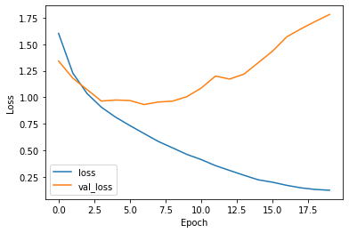
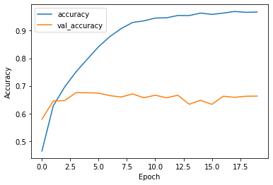
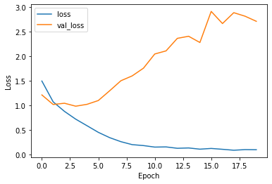
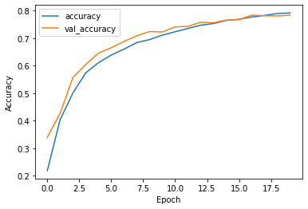
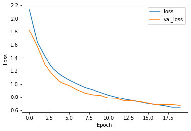
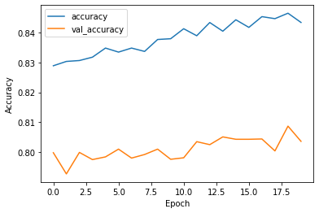

#WEEK 6 : Convolutional Neural Networks for CIFAR-10 Image Classification


```python
try :
  # % tensorflow_version only exists in Colab .
  % tensorflow_version 2.x
except Exception :
  pass
```

#Activate GPU in google colab


```python
import tensorflow as tf

tf.test.gpu_device_name()
```


    '/device:GPU:0'


Ok this is done ! 

# Check which GPU I'm using


```python
from tensorflow.python.client import device_lib

device_lib.list_local_devices()
```


    [name: "/device:CPU:0"
     device_type: "CPU"
     memory_limit: 268435456
     locality {
     }
     incarnation: 7099652750107230715, name: "/device:GPU:0"
     device_type: "GPU"
     memory_limit: 14674281152
     locality {
       bus_id: 1
       links {
       }
     }
     incarnation: 5003225840288030787
     physical_device_desc: "device: 0, name: Tesla T4, pci bus id: 0000:00:04.0, compute capability: 7.5"]


# Exe. 1: Load the CIFAR-10 dataset from Keras


```python
(x_train, y_train), (x_test, y_test) = tf.keras.datasets.cifar10.load_data()

class_names = ['airplane', 'automobile', 'bird', 'cat', 'deer',
               'dog', 'frog', 'horse', 'ship', 'truck']

               
import numpy as np
len(np.unique(y_train))


```

    Downloading data from https://www.cs.toronto.edu/~kriz/cifar-10-python.tar.gz
    170500096/170498071 [==============================] - 3s 0us/step
    


    10


```python
x_train
```


    array([[[[ 59,  62,  63],
             [ 43,  46,  45],
             [ 50,  48,  43],
             ...,
             [158, 132, 108],
             [152, 125, 102],
             [148, 124, 103]],
    
            [[ 16,  20,  20],
             [  0,   0,   0],
             [ 18,   8,   0],
             ...,
             [123,  88,  55],
             [119,  83,  50],
             [122,  87,  57]],
    
            [[ 25,  24,  21],
             [ 16,   7,   0],
             [ 49,  27,   8],
             ...,
             [118,  84,  50],
             [120,  84,  50],
             [109,  73,  42]],
    
            ...,
    
            [[208, 170,  96],
             [201, 153,  34],
             [198, 161,  26],
             ...,
             [160, 133,  70],
             [ 56,  31,   7],
             [ 53,  34,  20]],
    
            [[180, 139,  96],
             [173, 123,  42],
             [186, 144,  30],
             ...,
             [184, 148,  94],
             [ 97,  62,  34],
             [ 83,  53,  34]],
    
            [[177, 144, 116],
             [168, 129,  94],
             [179, 142,  87],
             ...,
             [216, 184, 140],
             [151, 118,  84],
             [123,  92,  72]]],
    
    
           [[[154, 177, 187],
             [126, 137, 136],
             [105, 104,  95],
             ...,
             [ 91,  95,  71],
             [ 87,  90,  71],
             [ 79,  81,  70]],
    
            [[140, 160, 169],
             [145, 153, 154],
             [125, 125, 118],
             ...,
             [ 96,  99,  78],
             [ 77,  80,  62],
             [ 71,  73,  61]],
    
            [[140, 155, 164],
             [139, 146, 149],
             [115, 115, 112],
             ...,
             [ 79,  82,  64],
             [ 68,  70,  55],
             [ 67,  69,  55]],
    
            ...,
    
            [[175, 167, 166],
             [156, 154, 160],
             [154, 160, 170],
             ...,
             [ 42,  34,  36],
             [ 61,  53,  57],
             [ 93,  83,  91]],
    
            [[165, 154, 128],
             [156, 152, 130],
             [159, 161, 142],
             ...,
             [103,  93,  96],
             [123, 114, 120],
             [131, 121, 131]],
    
            [[163, 148, 120],
             [158, 148, 122],
             [163, 156, 133],
             ...,
             [143, 133, 139],
             [143, 134, 142],
             [143, 133, 144]]],
    
    
           [[[255, 255, 255],
             [253, 253, 253],
             [253, 253, 253],
             ...,
             [253, 253, 253],
             [253, 253, 253],
             [253, 253, 253]],
    
            [[255, 255, 255],
             [255, 255, 255],
             [255, 255, 255],
             ...,
             [255, 255, 255],
             [255, 255, 255],
             [255, 255, 255]],
    
            [[255, 255, 255],
             [254, 254, 254],
             [254, 254, 254],
             ...,
             [254, 254, 254],
             [254, 254, 254],
             [254, 254, 254]],
    
            ...,
    
            [[113, 120, 112],
             [111, 118, 111],
             [105, 112, 106],
             ...,
             [ 72,  81,  80],
             [ 72,  80,  79],
             [ 72,  80,  79]],
    
            [[111, 118, 110],
             [104, 111, 104],
             [ 99, 106,  98],
             ...,
             [ 68,  75,  73],
             [ 70,  76,  75],
             [ 78,  84,  82]],
    
            [[106, 113, 105],
             [ 99, 106,  98],
             [ 95, 102,  94],
             ...,
             [ 78,  85,  83],
             [ 79,  85,  83],
             [ 80,  86,  84]]],
    
    
           ...,
    
    
           [[[ 35, 178, 235],
             [ 40, 176, 239],
             [ 42, 176, 241],
             ...,
             [ 99, 177, 219],
             [ 79, 147, 197],
             [ 89, 148, 189]],
    
            [[ 57, 182, 234],
             [ 44, 184, 250],
             [ 50, 183, 240],
             ...,
             [156, 182, 200],
             [141, 177, 206],
             [116, 149, 175]],
    
            [[ 98, 197, 237],
             [ 64, 189, 252],
             [ 69, 192, 245],
             ...,
             [188, 195, 206],
             [119, 135, 147],
             [ 61,  79,  90]],
    
            ...,
    
            [[ 73,  79,  77],
             [ 53,  63,  68],
             [ 54,  68,  80],
             ...,
             [ 17,  40,  64],
             [ 21,  36,  51],
             [ 33,  48,  49]],
    
            [[ 61,  68,  75],
             [ 55,  70,  86],
             [ 57,  79, 103],
             ...,
             [ 24,  48,  72],
             [ 17,  35,  53],
             [  7,  23,  32]],
    
            [[ 44,  56,  73],
             [ 46,  66,  88],
             [ 49,  77, 105],
             ...,
             [ 27,  52,  77],
             [ 21,  43,  66],
             [ 12,  31,  50]]],
    
    
           [[[189, 211, 240],
             [186, 208, 236],
             [185, 207, 235],
             ...,
             [175, 195, 224],
             [172, 194, 222],
             [169, 194, 220]],
    
            [[194, 210, 239],
             [191, 207, 236],
             [190, 206, 235],
             ...,
             [173, 192, 220],
             [171, 191, 218],
             [167, 190, 216]],
    
            [[208, 219, 244],
             [205, 216, 240],
             [204, 215, 239],
             ...,
             [175, 191, 217],
             [172, 190, 216],
             [169, 191, 215]],
    
            ...,
    
            [[207, 199, 181],
             [203, 195, 175],
             [203, 196, 173],
             ...,
             [135, 132, 127],
             [162, 158, 150],
             [168, 163, 151]],
    
            [[198, 190, 170],
             [189, 181, 159],
             [180, 172, 147],
             ...,
             [178, 171, 160],
             [175, 169, 156],
             [175, 169, 154]],
    
            [[198, 189, 173],
             [189, 181, 162],
             [178, 170, 149],
             ...,
             [195, 184, 169],
             [196, 189, 171],
             [195, 190, 171]]],
    
    
           [[[229, 229, 239],
             [236, 237, 247],
             [234, 236, 247],
             ...,
             [217, 219, 233],
             [221, 223, 234],
             [222, 223, 233]],
    
            [[222, 221, 229],
             [239, 239, 249],
             [233, 234, 246],
             ...,
             [223, 223, 236],
             [227, 228, 238],
             [210, 211, 220]],
    
            [[213, 206, 211],
             [234, 232, 239],
             [231, 233, 244],
             ...,
             [220, 220, 232],
             [220, 219, 232],
             [202, 203, 215]],
    
            ...,
    
            [[150, 143, 135],
             [140, 135, 127],
             [132, 127, 120],
             ...,
             [224, 222, 218],
             [230, 228, 225],
             [241, 241, 238]],
    
            [[137, 132, 126],
             [130, 127, 120],
             [125, 121, 115],
             ...,
             [181, 180, 178],
             [202, 201, 198],
             [212, 211, 207]],
    
            [[122, 119, 114],
             [118, 116, 110],
             [120, 116, 111],
             ...,
             [179, 177, 173],
             [164, 164, 162],
             [163, 163, 161]]]], dtype=uint8)


#Exe. 2: Data preparation


Convert train and test X values to float32 and normalize data between


```python
x_train = x_train.astype('float32')
x_test = x_test.astype('float32')

# normalize to range 0-1
x_train = x_train / 255.0
x_test = x_test / 255.0
```


```python
x_train.shape
```


    (50000, 32, 32, 3)


50 000 images of size:   32 x 32 x 3

#Exe. 3 Define a network model with the following architecture:

**CONV - POOL - CONV - POOL - CONV - POOL - FC - FC**

- convolutional layer kernel_size=3 for size filter = 3*3


```python
from tensorflow import keras
from keras.layers import Dense, Conv2D, Flatten, MaxPooling2D

model_1 = keras.Sequential()

# convolution neural layer (CONV)
model_1.add(keras.layers.Conv2D(32, (3, 3), input_shape=(32, 32, 3)))

# max pooling layer (POOL)
model_1.add(keras.layers.MaxPooling2D(pool_size = (2, 2), strides = 2))


model_1.add(keras.layers.Conv2D(64, (3, 3)))
model_1.add(keras.layers.MaxPooling2D(pool_size = (2, 2), strides = 2))

model_1.add(keras.layers.Conv2D(64, (3, 3)))
model_1.add(keras.layers.MaxPooling2D(pool_size = (2, 2), strides = 2))

model_1.add(keras.layers.Flatten())

model_1.add(keras.layers.Dense(512, activation ='relu'))
model_1.add(keras.layers.Dense(10, activation ='softmax'))


```

# Exe. 4: Pn  & On

**Pn** is the number of parameters:
- **m * n** is the filter dimension 
- **Ci and Co** are the input and output channel (feature map) dimensions respectively for a convolutional layer.


**On** dimensions of the output data matrix:
- **N** is the input dimension
- **F** is the filter dimension similar to m*n : m = n = F
- **S** is the filter stride length


```python
def Pn(m, n, Ci, Co):
  return ((m * n * Ci) + 1) * Co

def On(N, F, S):
  return ((N - F) / S) + 1

# first conv layer: 
# kernel_size=3*3=m*n
# feature map start to 3 dimensions rgb
# output chanel is difined to 32

print(Pn(3,3, 3, 32))

print(Pn(3,3, 32, 64))

print(Pn(3,3, 64, 64))


# input dim = 32
# filter dim = 3
# stride dim = 1

print('\nCONV 1')
print(On(32, 3, 1))
# POOL 1
print(On(30, 2, 2))

print('\nCONV 2')
print(On(15, 3, 1))
# POOL 2
print(On(13, 2, 2))

print('\nCONV 3')
print(On(6, 3, 1))
# POOL 3
print(On(4, 2, 2))

```

    896
    18496
    36928
    
    CONV 1
    30.0
    15.0
    
    CONV 2
    13.0
    6.5
    
    CONV 3
    4.0
    2.0
    

we can check calculation by printing model.summary()


```python
model_1.summary()
```

    Model: "sequential"
    _________________________________________________________________
    Layer (type)                 Output Shape              Param #   
    =================================================================
    conv2d (Conv2D)              (None, 30, 30, 32)        896       
    _________________________________________________________________
    max_pooling2d (MaxPooling2D) (None, 15, 15, 32)        0         
    _________________________________________________________________
    conv2d_1 (Conv2D)            (None, 13, 13, 64)        18496     
    _________________________________________________________________
    max_pooling2d_1 (MaxPooling2 (None, 6, 6, 64)          0         
    _________________________________________________________________
    conv2d_2 (Conv2D)            (None, 4, 4, 64)          36928     
    _________________________________________________________________
    max_pooling2d_2 (MaxPooling2 (None, 2, 2, 64)          0         
    _________________________________________________________________
    flatten (Flatten)            (None, 256)               0         
    _________________________________________________________________
    dense (Dense)                (None, 512)               131584    
    _________________________________________________________________
    dense_1 (Dense)              (None, 10)                5130      
    =================================================================
    Total params: 193,034
    Trainable params: 193,034
    Non-trainable params: 0
    _________________________________________________________________
    

# Exe. 5 Compile the model

Compile the model with an adam optimizer and a sparse categorical_crossentropy loss function.


```python
model_1.compile(optimizer='adam', loss='sparse_categorical_crossentropy', metrics=['accuracy'])
```

#Exe. 6 Train the model 

Train the model with 20% of validation data with 128 batches and 20 epochs. Save the fitting result in a variable called history.


```python
history = model_1.fit(x_train, y_train, validation_data =(x_test, y_test), epochs=20, batch_size=128, validation_split=0.2)
```

    Epoch 1/20
    313/313 [==============================] - 35s 8ms/step - loss: 1.8162 - accuracy: 0.3341 - val_loss: 1.3423 - val_accuracy: 0.5265
    Epoch 2/20
    313/313 [==============================] - 2s 6ms/step - loss: 1.2758 - accuracy: 0.5457 - val_loss: 1.1800 - val_accuracy: 0.5870
    Epoch 3/20
    313/313 [==============================] - 2s 6ms/step - loss: 1.0548 - accuracy: 0.6310 - val_loss: 1.0725 - val_accuracy: 0.6288
    Epoch 4/20
    313/313 [==============================] - 2s 6ms/step - loss: 0.9106 - accuracy: 0.6842 - val_loss: 0.9645 - val_accuracy: 0.6677
    Epoch 5/20
    313/313 [==============================] - 2s 6ms/step - loss: 0.8039 - accuracy: 0.7209 - val_loss: 0.9744 - val_accuracy: 0.6670
    Epoch 6/20
    313/313 [==============================] - 2s 6ms/step - loss: 0.7257 - accuracy: 0.7476 - val_loss: 0.9693 - val_accuracy: 0.6792
    Epoch 7/20
    313/313 [==============================] - 2s 6ms/step - loss: 0.6451 - accuracy: 0.7786 - val_loss: 0.9317 - val_accuracy: 0.6940
    Epoch 8/20
    313/313 [==============================] - 2s 6ms/step - loss: 0.5716 - accuracy: 0.8048 - val_loss: 0.9554 - val_accuracy: 0.6935
    Epoch 9/20
    313/313 [==============================] - 2s 6ms/step - loss: 0.5096 - accuracy: 0.8254 - val_loss: 0.9642 - val_accuracy: 0.6970
    Epoch 10/20
    313/313 [==============================] - 2s 6ms/step - loss: 0.4471 - accuracy: 0.8466 - val_loss: 1.0062 - val_accuracy: 0.6938
    Epoch 11/20
    313/313 [==============================] - 2s 6ms/step - loss: 0.3907 - accuracy: 0.8673 - val_loss: 1.0870 - val_accuracy: 0.6913
    Epoch 12/20
    313/313 [==============================] - 2s 6ms/step - loss: 0.3317 - accuracy: 0.8862 - val_loss: 1.2003 - val_accuracy: 0.6746
    Epoch 13/20
    313/313 [==============================] - 2s 6ms/step - loss: 0.2883 - accuracy: 0.9013 - val_loss: 1.1721 - val_accuracy: 0.6851
    Epoch 14/20
    313/313 [==============================] - 2s 6ms/step - loss: 0.2417 - accuracy: 0.9178 - val_loss: 1.2190 - val_accuracy: 0.6933
    Epoch 15/20
    313/313 [==============================] - 2s 6ms/step - loss: 0.2030 - accuracy: 0.9314 - val_loss: 1.3265 - val_accuracy: 0.6894
    Epoch 16/20
    313/313 [==============================] - 2s 6ms/step - loss: 0.1835 - accuracy: 0.9370 - val_loss: 1.4356 - val_accuracy: 0.6876
    Epoch 17/20
    313/313 [==============================] - 2s 6ms/step - loss: 0.1451 - accuracy: 0.9511 - val_loss: 1.5709 - val_accuracy: 0.6852
    Epoch 18/20
    313/313 [==============================] - 2s 6ms/step - loss: 0.1414 - accuracy: 0.9517 - val_loss: 1.6467 - val_accuracy: 0.6807
    Epoch 19/20
    313/313 [==============================] - 2s 6ms/step - loss: 0.1152 - accuracy: 0.9602 - val_loss: 1.7163 - val_accuracy: 0.6815
    Epoch 20/20
    313/313 [==============================] - 2s 6ms/step - loss: 0.1067 - accuracy: 0.9634 - val_loss: 1.7822 - val_accuracy: 0.6766
    

# Exe. 7: Evaluation of the model


```python
results = model_1.evaluate(x_test, y_test)
print("test loss, test acc:", results)
```

    313/313 [==============================] - 1s 2ms/step - loss: 1.7768 - accuracy: 0.6731
    test loss, test acc: [1.7767970561981201, 0.6730999946594238]
    

# Exe. 8: Predictions

As a test, predict the test dataset using model.predict()


```python
predictions = model_1.predict(x_test)
print("predictions shape:", predictions.shape)


print("Expected : ", class_names[np.argmax(predictions[0])])
print("Got      : ", class_names[int(y_test[0])])

```

    predictions shape: (10000, 10)
    Expected :  cat
    Got      :  cat
    

#Exe. 9: Graph => Accuracy VS Validation Accuracy


```python
import matplotlib.pyplot as plt

plt.plot(history.history['accuracy'], label='accuracy')
plt.plot(history.history['val_accuracy'], label = 'val_accuracy')
plt.xlabel('Epoch')
plt.ylabel('Accuracy')

plt.legend()

```


    <matplotlib.legend.Legend at 0x7fd160267650>


    

    


```python
print(history.history.keys())
```

    dict_keys(['loss', 'accuracy', 'val_loss', 'val_accuracy'])
    

**How is the deviation between two curves?**
- the 2 curves move away from each other (not good)

**What are your observations?**

- We model is overfitted. As we can see accuracy on train data is very hight (above 90%) but when we're focusing on validation accuracy curve, the result is very bad. So, the model is not well fitted.

#Exe. 10 : Graph => loss VS Validation val_loss


```python
plt.plot(history.history['loss'], label='loss')
plt.plot(history.history['val_loss'], label = 'val_loss')
plt.xlabel('Epoch')
plt.ylabel('Loss')

plt.legend()
```


    <matplotlib.legend.Legend at 0x7fd1601c2f10>


    

    


**What are your observations?**

- Underfitting < 2.5 Epochs
- Just right = 2.5 Epochs
- Overfitting > 2.5 Epochs


**After how many epochs, the overfitting happens?**
- When epochs > 2.5


#Exe. 11: Defining a new model


Define a new model (NET II) with higher filter/kernel size (filter size: 5 * 5) as below:

- **CONV - CONV - POOL - CONV - POOL - FC - FC**


```python
model_2 = keras.Sequential()

# convolution neural layer (CONV)
model_2.add(keras.layers.Conv2D(32, (5, 5), input_shape=(32, 32, 3)))


model_2.add(keras.layers.Conv2D(64, (5, 5)))
model_2.add(keras.layers.MaxPooling2D(pool_size = (2, 2), strides = 2))

model_2.add(keras.layers.Conv2D(64, (5, 5)))
model_2.add(keras.layers.MaxPooling2D(pool_size = (2, 2), strides = 2))

model_2.add(keras.layers.Flatten())

model_2.add(keras.layers.Dense(512, activation ='relu'))
model_2.add(keras.layers.Dense(10, activation ='softmax'))
```

#Exe. 12: Print the summary of this model, check the number of parameters using the formula given in Exe. 4.


```python
model_2.summary()
```

    Model: "sequential_1"
    _________________________________________________________________
    Layer (type)                 Output Shape              Param #   
    =================================================================
    conv2d_3 (Conv2D)            (None, 28, 28, 32)        2432      
    _________________________________________________________________
    conv2d_4 (Conv2D)            (None, 24, 24, 64)        51264     
    _________________________________________________________________
    max_pooling2d_3 (MaxPooling2 (None, 12, 12, 64)        0         
    _________________________________________________________________
    conv2d_5 (Conv2D)            (None, 8, 8, 64)          102464    
    _________________________________________________________________
    max_pooling2d_4 (MaxPooling2 (None, 4, 4, 64)          0         
    _________________________________________________________________
    flatten_1 (Flatten)          (None, 1024)              0         
    _________________________________________________________________
    dense_2 (Dense)              (None, 512)               524800    
    _________________________________________________________________
    dense_3 (Dense)              (None, 10)                5130      
    =================================================================
    Total params: 686,090
    Trainable params: 686,090
    Non-trainable params: 0
    _________________________________________________________________
    

#Exe. 13: Compile the model


```python
model_2.compile(optimizer='adam', loss='sparse_categorical_crossentropy', metrics=['accuracy'])
```

#Exe. 14: Fit the model


```python
history = model_2.fit(x_train, y_train, validation_data =(x_test, y_test), epochs=20, batch_size=128, validation_split=0.2)
```

    Epoch 1/20
    313/313 [==============================] - 4s 11ms/step - loss: 1.7519 - accuracy: 0.3665 - val_loss: 1.2177 - val_accuracy: 0.5796
    Epoch 2/20
    313/313 [==============================] - 3s 9ms/step - loss: 1.1118 - accuracy: 0.6153 - val_loss: 1.0233 - val_accuracy: 0.6455
    Epoch 3/20
    313/313 [==============================] - 3s 9ms/step - loss: 0.8771 - accuracy: 0.6969 - val_loss: 1.0488 - val_accuracy: 0.6467
    Epoch 4/20
    313/313 [==============================] - 3s 9ms/step - loss: 0.7283 - accuracy: 0.7500 - val_loss: 0.9889 - val_accuracy: 0.6754
    Epoch 5/20
    313/313 [==============================] - 3s 10ms/step - loss: 0.5594 - accuracy: 0.8071 - val_loss: 1.0269 - val_accuracy: 0.6752
    Epoch 6/20
    313/313 [==============================] - 3s 10ms/step - loss: 0.4260 - accuracy: 0.8548 - val_loss: 1.1038 - val_accuracy: 0.6738
    Epoch 7/20
    313/313 [==============================] - 3s 9ms/step - loss: 0.3159 - accuracy: 0.8910 - val_loss: 1.3011 - val_accuracy: 0.6646
    Epoch 8/20
    313/313 [==============================] - 3s 10ms/step - loss: 0.2480 - accuracy: 0.9167 - val_loss: 1.5059 - val_accuracy: 0.6598
    Epoch 9/20
    313/313 [==============================] - 3s 10ms/step - loss: 0.1817 - accuracy: 0.9399 - val_loss: 1.6047 - val_accuracy: 0.6710
    Epoch 10/20
    313/313 [==============================] - 3s 10ms/step - loss: 0.1612 - accuracy: 0.9463 - val_loss: 1.7614 - val_accuracy: 0.6571
    Epoch 11/20
    313/313 [==============================] - 3s 10ms/step - loss: 0.1410 - accuracy: 0.9506 - val_loss: 2.0497 - val_accuracy: 0.6663
    Epoch 12/20
    313/313 [==============================] - 3s 10ms/step - loss: 0.1354 - accuracy: 0.9547 - val_loss: 2.1127 - val_accuracy: 0.6570
    Epoch 13/20
    313/313 [==============================] - 3s 10ms/step - loss: 0.1354 - accuracy: 0.9539 - val_loss: 2.3675 - val_accuracy: 0.6662
    Epoch 14/20
    313/313 [==============================] - 3s 10ms/step - loss: 0.1162 - accuracy: 0.9617 - val_loss: 2.4099 - val_accuracy: 0.6335
    Epoch 15/20
    313/313 [==============================] - 3s 10ms/step - loss: 0.1144 - accuracy: 0.9640 - val_loss: 2.2832 - val_accuracy: 0.6480
    Epoch 16/20
    313/313 [==============================] - 3s 9ms/step - loss: 0.1140 - accuracy: 0.9634 - val_loss: 2.9149 - val_accuracy: 0.6332
    Epoch 17/20
    313/313 [==============================] - 3s 10ms/step - loss: 0.1180 - accuracy: 0.9615 - val_loss: 2.6683 - val_accuracy: 0.6626
    Epoch 18/20
    313/313 [==============================] - 3s 9ms/step - loss: 0.0804 - accuracy: 0.9734 - val_loss: 2.8892 - val_accuracy: 0.6586
    Epoch 19/20
    313/313 [==============================] - 3s 10ms/step - loss: 0.0908 - accuracy: 0.9699 - val_loss: 2.8176 - val_accuracy: 0.6626
    Epoch 20/20
    313/313 [==============================] - 3s 10ms/step - loss: 0.0907 - accuracy: 0.9720 - val_loss: 2.7136 - val_accuracy: 0.6631
    

#Exe. 15 Evaluate the model on test dataset


```python
results = model_2.evaluate(x_test, y_test)
print("test loss, test acc:", results)
```

    313/313 [==============================] - 1s 3ms/step - loss: 2.6634 - accuracy: 0.6635
    test loss, test acc: [2.6633846759796143, 0.6635000109672546]
    


```python
predictions2 = model_2.predict(x_test)
print("predictions shape:", predictions2.shape)


print("Expected : ", class_names[np.argmax(predictions2[0])])
print("Got      : ", class_names[int(y_test[0])])
```

    predictions shape: (10000, 10)
    Expected :  cat
    Got      :  cat
    

#Exe. 16


```python
plt.plot(history.history['accuracy'], label='accuracy')
plt.plot(history.history['val_accuracy'], label = 'val_accuracy')
plt.xlabel('Epoch')
plt.ylabel('Accuracy')

plt.legend()
```


    <matplotlib.legend.Legend at 0x7fd1240af490>


    

    


```python
plt.plot(history.history['loss'], label='loss')
plt.plot(history.history['val_loss'], label = 'val_loss')
plt.xlabel('Epoch')
plt.ylabel('Loss')

plt.legend()
```


    <matplotlib.legend.Legend at 0x7fd1240f44d0>


    

    


**How the loss and accuracy change for the training and validation according to epochs?** 

- As we can see : 
    - in accuracy graph, acc grows while val_acc stagnates.
    - in loss graph, loss decreases while val_loss grows rapidly.


**What are your observations?** 
- Underfitting < 1 Epochs
- Just right = 1 Epochs
- Overfitting > 1 Epochs


**How is the overfitting now?** 
- It's not better ! 

**After how many epochs happens?** 
- After 1 Epoch

**How is the deviation between training and validation in comparison to NET I model?**

- it's very close.

**Note:** In general, a smaller filter/ kernel size can capture complex non-linearities in the input as a lesser number of pixels are averaged at an instance, thus variations in data are better sustained.

# Exe. 17

Define a deeper model (NET III) as an improvement of NET I and
NET II:
CONV CONV POOL CONV POOL CONV CONV CONV POOL FC FC FC


```python
from tensorflow.keras import regularizers

model_3 = keras.Sequential()

# convolution neural layer (CONV)
model_3.add(keras.layers.Conv2D(96, (3, 3), strides =1, activation ='relu', input_shape=(32, 32, 3)))
model_3.add(keras.layers.Conv2D(96, (3, 3), strides =1, activation ='relu'))

model_3.add(keras.layers.MaxPooling2D(pool_size = (2, 2), strides = 2))
model_3.add(keras.layers.Dropout(0.5))

model_3.add(keras.layers.Conv2D(128, (3, 3), strides =1, activation ='relu'))

#model_3.add(keras.layers.MaxPooling2D(pool_size = (2, 2), strides = 2))
#model_3.add(keras.layers.Dropout(0.5))

model_3.add(keras.layers.Conv2D(128, (3, 3), strides =1, activation ='relu'))
model_3.add(keras.layers.Conv2D(128, (3, 3), strides =1, activation ='relu'))
model_3.add(keras.layers.Conv2D(128, (3, 3), strides =1, activation ='relu'))

model_3.add(keras.layers.MaxPooling2D(pool_size = (2, 2), strides = 2))
model_3.add(keras.layers.Dropout(0.5))


model_3.add(keras.layers.Flatten())

model_3.add(keras.layers.Dense(1024, activation ='relu', kernel_regularizer=regularizers.l2(0.0005)))
model_3.add(keras.layers.Dense(512, activation ='relu', kernel_regularizer=regularizers.l2(0.0005)))
model_3.add(keras.layers.Dense(10, activation ='softmax', kernel_regularizer=regularizers.l2(0.0005)))
```


```python
model_3.compile(optimizer='adam', loss='sparse_categorical_crossentropy', metrics=['accuracy'])
```


```python
history = model_3.fit(x_train, y_train, validation_data =(x_test, y_test), epochs=20, batch_size=128, validation_split=0.2)
```

    Epoch 1/20
    313/313 [==============================] - 10s 28ms/step - loss: 2.4557 - accuracy: 0.1570 - val_loss: 1.8190 - val_accuracy: 0.3402
    Epoch 2/20
    313/313 [==============================] - 8s 26ms/step - loss: 1.7235 - accuracy: 0.3675 - val_loss: 1.5699 - val_accuracy: 0.4271
    Epoch 3/20
    313/313 [==============================] - 8s 26ms/step - loss: 1.4631 - accuracy: 0.4797 - val_loss: 1.2831 - val_accuracy: 0.5564
    Epoch 4/20
    313/313 [==============================] - 8s 26ms/step - loss: 1.2715 - accuracy: 0.5621 - val_loss: 1.1332 - val_accuracy: 0.6044
    Epoch 5/20
    313/313 [==============================] - 8s 26ms/step - loss: 1.1457 - accuracy: 0.6060 - val_loss: 1.0223 - val_accuracy: 0.6454
    Epoch 6/20
    313/313 [==============================] - 8s 26ms/step - loss: 1.0739 - accuracy: 0.6325 - val_loss: 0.9784 - val_accuracy: 0.6652
    Epoch 7/20
    313/313 [==============================] - 8s 26ms/step - loss: 1.0051 - accuracy: 0.6580 - val_loss: 0.9136 - val_accuracy: 0.6878
    Epoch 8/20
    313/313 [==============================] - 8s 26ms/step - loss: 0.9506 - accuracy: 0.6815 - val_loss: 0.8617 - val_accuracy: 0.7085
    Epoch 9/20
    313/313 [==============================] - 8s 26ms/step - loss: 0.9242 - accuracy: 0.6913 - val_loss: 0.8356 - val_accuracy: 0.7239
    Epoch 10/20
    313/313 [==============================] - 8s 26ms/step - loss: 0.8714 - accuracy: 0.7111 - val_loss: 0.8266 - val_accuracy: 0.7224
    Epoch 11/20
    313/313 [==============================] - 8s 26ms/step - loss: 0.8342 - accuracy: 0.7237 - val_loss: 0.7857 - val_accuracy: 0.7407
    Epoch 12/20
    313/313 [==============================] - 8s 26ms/step - loss: 0.7949 - accuracy: 0.7348 - val_loss: 0.7808 - val_accuracy: 0.7427
    Epoch 13/20
    313/313 [==============================] - 8s 26ms/step - loss: 0.7702 - accuracy: 0.7486 - val_loss: 0.7426 - val_accuracy: 0.7575
    Epoch 14/20
    313/313 [==============================] - 8s 26ms/step - loss: 0.7372 - accuracy: 0.7571 - val_loss: 0.7441 - val_accuracy: 0.7557
    Epoch 15/20
    313/313 [==============================] - 8s 26ms/step - loss: 0.7141 - accuracy: 0.7663 - val_loss: 0.7292 - val_accuracy: 0.7655
    Epoch 16/20
    313/313 [==============================] - 8s 26ms/step - loss: 0.6918 - accuracy: 0.7700 - val_loss: 0.7073 - val_accuracy: 0.7670
    Epoch 17/20
    313/313 [==============================] - 8s 26ms/step - loss: 0.6882 - accuracy: 0.7777 - val_loss: 0.6824 - val_accuracy: 0.7834
    Epoch 18/20
    313/313 [==============================] - 8s 26ms/step - loss: 0.6737 - accuracy: 0.7802 - val_loss: 0.6848 - val_accuracy: 0.7814
    Epoch 19/20
    313/313 [==============================] - 8s 26ms/step - loss: 0.6356 - accuracy: 0.7909 - val_loss: 0.6849 - val_accuracy: 0.7806
    Epoch 20/20
    313/313 [==============================] - 8s 26ms/step - loss: 0.6403 - accuracy: 0.7929 - val_loss: 0.6724 - val_accuracy: 0.7834
    

#Exe. 18: Evalution of the third model


```python
results = model_3.evaluate(x_test, y_test)
print("test loss, test acc:", results)
```

    313/313 [==============================] - 1s 4ms/step - loss: 0.6991 - accuracy: 0.7770
    test loss, test acc: [0.6991159319877625, 0.7770000100135803]
    


```python
predictions3 = model_3.predict(x_test)
print("predictions shape:", predictions3.shape)


print("Expected : ", class_names[np.argmax(predictions3[0])])
print("Got      : ", class_names[int(y_test[0])])
```

    predictions shape: (10000, 10)
    Expected :  cat
    Got      :  cat
    


```python
plt.plot(history.history['accuracy'], label='accuracy')
plt.plot(history.history['val_accuracy'], label = 'val_accuracy')
plt.xlabel('Epoch')
plt.ylabel('Accuracy')
plt.legend()

```


    <matplotlib.legend.Legend at 0x7fd11c120cd0>


    

    


```python
plt.plot(history.history['loss'], label='loss')
plt.plot(history.history['val_loss'], label = 'val_loss')
plt.xlabel('Epoch')
plt.ylabel('Loss')
plt.legend()
```


    <matplotlib.legend.Legend at 0x7fd11c0c2ad0>


    

    


**Do we have overfitting in this model too?** 

- This model is the best compered to other. 
- By focusing on graphs, we can see that validation accuracy grows at the same time of accuracy.

**How is the deviation between training and evaluation accuracy?**
- the 2 curves are close to each other. It is good.

#Exe. 19


```python
from keras import optimizers

opt = optimizers.SGD(lr=0.001, momentum=0.9)
model_3.compile(optimizer=opt, loss='sparse_categorical_crossentropy', metrics=['accuracy'])

```


```python
history = model_3.fit(x_train, y_train, validation_data =(x_test, y_test), epochs=20, batch_size=128, validation_split=0.2)
```

    Epoch 1/20
    313/313 [==============================] - 9s 26ms/step - loss: 0.5196 - accuracy: 0.8325 - val_loss: 0.6365 - val_accuracy: 0.7998
    Epoch 2/20
    313/313 [==============================] - 8s 25ms/step - loss: 0.5283 - accuracy: 0.8271 - val_loss: 0.6479 - val_accuracy: 0.7927
    Epoch 3/20
    313/313 [==============================] - 8s 25ms/step - loss: 0.5221 - accuracy: 0.8307 - val_loss: 0.6314 - val_accuracy: 0.7999
    Epoch 4/20
    313/313 [==============================] - 8s 25ms/step - loss: 0.5110 - accuracy: 0.8328 - val_loss: 0.6373 - val_accuracy: 0.7975
    Epoch 5/20
    313/313 [==============================] - 8s 25ms/step - loss: 0.5035 - accuracy: 0.8388 - val_loss: 0.6369 - val_accuracy: 0.7984
    Epoch 6/20
    313/313 [==============================] - 8s 25ms/step - loss: 0.5106 - accuracy: 0.8334 - val_loss: 0.6273 - val_accuracy: 0.8010
    Epoch 7/20
    313/313 [==============================] - 8s 25ms/step - loss: 0.5062 - accuracy: 0.8338 - val_loss: 0.6262 - val_accuracy: 0.7980
    Epoch 8/20
    313/313 [==============================] - 8s 25ms/step - loss: 0.5031 - accuracy: 0.8353 - val_loss: 0.6392 - val_accuracy: 0.7992
    Epoch 9/20
    313/313 [==============================] - 8s 25ms/step - loss: 0.4999 - accuracy: 0.8383 - val_loss: 0.6300 - val_accuracy: 0.8010
    Epoch 10/20
    313/313 [==============================] - 8s 25ms/step - loss: 0.4936 - accuracy: 0.8379 - val_loss: 0.6368 - val_accuracy: 0.7976
    Epoch 11/20
    313/313 [==============================] - 8s 25ms/step - loss: 0.4941 - accuracy: 0.8418 - val_loss: 0.6387 - val_accuracy: 0.7981
    Epoch 12/20
    313/313 [==============================] - 8s 26ms/step - loss: 0.4937 - accuracy: 0.8393 - val_loss: 0.6250 - val_accuracy: 0.8035
    Epoch 13/20
    313/313 [==============================] - 8s 26ms/step - loss: 0.4804 - accuracy: 0.8447 - val_loss: 0.6243 - val_accuracy: 0.8025
    Epoch 14/20
    313/313 [==============================] - 8s 26ms/step - loss: 0.4827 - accuracy: 0.8415 - val_loss: 0.6223 - val_accuracy: 0.8051
    Epoch 15/20
    313/313 [==============================] - 8s 25ms/step - loss: 0.4749 - accuracy: 0.8478 - val_loss: 0.6168 - val_accuracy: 0.8043
    Epoch 16/20
    313/313 [==============================] - 8s 26ms/step - loss: 0.4762 - accuracy: 0.8463 - val_loss: 0.6164 - val_accuracy: 0.8043
    Epoch 17/20
    313/313 [==============================] - 8s 26ms/step - loss: 0.4782 - accuracy: 0.8455 - val_loss: 0.6247 - val_accuracy: 0.8044
    Epoch 18/20
    313/313 [==============================] - 8s 26ms/step - loss: 0.4824 - accuracy: 0.8434 - val_loss: 0.6334 - val_accuracy: 0.8004
    Epoch 19/20
    313/313 [==============================] - 8s 26ms/step - loss: 0.4777 - accuracy: 0.8472 - val_loss: 0.6088 - val_accuracy: 0.8087
    Epoch 20/20
    313/313 [==============================] - 8s 26ms/step - loss: 0.4743 - accuracy: 0.8452 - val_loss: 0.6145 - val_accuracy: 0.8036
    


```python
results = model_3.evaluate(x_test, y_test)
print("test loss, test acc:", results)
```

    313/313 [==============================] - 1s 4ms/step - loss: 0.6314 - accuracy: 0.7991
    test loss, test acc: [0.6313676238059998, 0.7990999817848206]
    


```python
plt.plot(history.history['accuracy'], label='accuracy')
plt.plot(history.history['val_accuracy'], label = 'val_accuracy')
plt.xlabel('Epoch')
plt.ylabel('Accuracy')
plt.legend()
```


    <matplotlib.legend.Legend at 0x7fd1142a3050>


    

    

