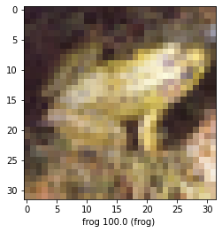

```python
try :
# % tensorflow_version only exists in Colab .
  % tensorflow_version 2.x
except Exception :
  pass
```


```python
from __future__ import absolute_import , division , print_function , unicode_literals

# TensorFlow and tf. keras
import tensorflow as tf
from tensorflow import keras

# Helper libraries
import numpy as np
import matplotlib . pyplot as plt
```


```python
print (tf. __version__ )
```

    2.4.0
    


```python
data = keras . datasets . cifar10
cifar10_data = data . load_data ()
```


```python
type(cifar10_data)
len(cifar10_data)
```


    2


```python
( train_images , train_labels ) ,( test_images , test_labels ) = cifar10_data
```


```python
print ( train_images [0])
```

    [[[ 59  62  63]
      [ 43  46  45]
      [ 50  48  43]
      ...
      [158 132 108]
      [152 125 102]
      [148 124 103]]
    
     [[ 16  20  20]
      [  0   0   0]
      [ 18   8   0]
      ...
      [123  88  55]
      [119  83  50]
      [122  87  57]]
    
     [[ 25  24  21]
      [ 16   7   0]
      [ 49  27   8]
      ...
      [118  84  50]
      [120  84  50]
      [109  73  42]]
    
     ...
    
     [[208 170  96]
      [201 153  34]
      [198 161  26]
      ...
      [160 133  70]
      [ 56  31   7]
      [ 53  34  20]]
    
     [[180 139  96]
      [173 123  42]
      [186 144  30]
      ...
      [184 148  94]
      [ 97  62  34]
      [ 83  53  34]]
    
     [[177 144 116]
      [168 129  94]
      [179 142  87]
      ...
      [216 184 140]
      [151 118  84]
      [123  92  72]]]
    


```python
print ( train_images [0]. shape )
```

    (32, 32, 3)
    


```python
class_names = [ 'airplane' , 'automobile' , 'bird' , 'cat' , 'deer', 'dog' , 'frog' , 'horse' , 'ship' , 'truck']
```


```python
len(train_images)
```


    50000


```python
len(train_labels)
```


    50000


```python
len(test_images)
```


    10000


```python
len(train_labels)
```


    50000


```python
type(train_labels)
```


    numpy.ndarray


```python
np.unique(train_labels) # number 0 to 9, a digit is associated to a label.
```


    array([0, 1, 2, 3, 4, 5, 6, 7, 8, 9], dtype=uint8)


(number of images, pixel number, pixel number, color), (n, height, width, depth)


```python
train_images.shape
```


    (50000, 32, 32, 3)


**Plot the Image**


```python
index = 8
plt.figure ()
plt.imshow ( train_images [ index ])
plt.colorbar ()
plt.grid ( False )
plt.show ()

train_labels[index]
```


    

    


    array([8], dtype=uint8)


```python
for i in range(2):
  plt.subplot()
  plt.xticks(np.arange(10), [class_names])
  #plt.yticks([])
  plt.imshow(train_images[i])
  plt.xlabel(train_labels)
```

    /usr/local/lib/python3.6/dist-packages/matplotlib/text.py:1165: FutureWarning: elementwise comparison failed; returning scalar instead, but in the future will perform elementwise comparison
      if s != self._text:
    /usr/local/lib/python3.6/dist-packages/ipykernel_launcher.py:2: MatplotlibDeprecationWarning: Adding an axes using the same arguments as a previous axes currently reuses the earlier instance.  In a future version, a new instance will always be created and returned.  Meanwhile, this warning can be suppressed, and the future behavior ensured, by passing a unique label to each axes instance.
      
    


    

    


```python
train_images = train_images / 255.0
```


```python
model = keras . Sequential([
keras.layers.Flatten( input_shape =(32 , 32, 3)),   # 
keras.layers.Dense(128 , activation ='relu'),       # 128 nodes for this layer
keras.layers.Dense(10 , activation ='softmax')])    # 10 nodes for this layer
```


```python
model.compile(optimizer ='adam',
loss ='sparse_categorical_crossentropy',
metrics =[ 'accuracy'])
```


```python
model.fit(train_images, train_labels, epochs =10)
```

    Epoch 1/10
    1563/1563 [==============================] - 5s 3ms/step - loss: 2.0245 - accuracy: 0.2697
    Epoch 2/10
    1563/1563 [==============================] - 5s 3ms/step - loss: 1.8053 - accuracy: 0.3532
    Epoch 3/10
    1563/1563 [==============================] - 5s 3ms/step - loss: 1.7354 - accuracy: 0.3832
    Epoch 4/10
    1563/1563 [==============================] - 5s 3ms/step - loss: 1.7107 - accuracy: 0.3933
    Epoch 5/10
    1563/1563 [==============================] - 5s 3ms/step - loss: 1.6840 - accuracy: 0.4035
    Epoch 6/10
    1563/1563 [==============================] - 5s 3ms/step - loss: 1.6588 - accuracy: 0.4118
    Epoch 7/10
    1563/1563 [==============================] - 5s 3ms/step - loss: 1.6483 - accuracy: 0.4110
    Epoch 8/10
    1563/1563 [==============================] - 5s 3ms/step - loss: 1.6428 - accuracy: 0.4157
    Epoch 9/10
    1563/1563 [==============================] - 5s 3ms/step - loss: 1.6184 - accuracy: 0.4219
    Epoch 10/10
    1563/1563 [==============================] - 5s 3ms/step - loss: 1.6191 - accuracy: 0.4242
    


    <tensorflow.python.keras.callbacks.History at 0x7fa6fb02b1d0>


```python
test_loss , test_acc = model . evaluate ( test_images , test_labels , verbose =2) # verbose print all step foreach epoch
```

    313/313 - 1s - loss: 212.7049 - accuracy: 0.3777
    


```python
predictions = model.predict(test_images)
```


```python
for i in range(3):
  print(predictions[i])
  print(np.argmax(predictions[i])==test_labels[i])

# each prediction contains 10 values because of our choice concerning layer 2
```

    [0.         0.         0.         0.43405646 0.         0.5659436
     0.         0.         0.         0.        ]
    [False]
    [0. 0. 0. 0. 0. 0. 0. 0. 1. 0.]
    [ True]
    [0. 0. 0. 0. 0. 0. 0. 0. 1. 0.]
    [ True]
    


```python
def pred(n):

  img = test_images[n]                             # np matrix 
  predict = round(max(predictions[n])*100, 2)      # be like 62 %
  lab_pred = np.argmax(predictions[n])             # be like airplane
  lab_true = test_labels[n]

  stringLab = str(class_names[lab_pred]) + " " + str(predict) + " (" + str(class_names[int(lab_true)]) + ") "
  plt.xlabel(stringLab)
  plt.imshow(img)


for i in range(5,20):
  pred(i)
  plt.figure()
```


    

    


    

    


    

    


    

    


    

    


    

    


    

    


    

    


    

    


    

    


    

    


    

    


    

    


    

    


    

    


    <Figure size 432x288 with 0 Axes>

