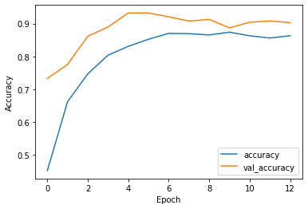

#Week 7 of Deep Learning: Challenge

**The goal is to achieve good performance (or as low degradation as possible) over time.**


**Attribute Information**


The response of the said sensors is read-out in the form of the resistance across the active layer of each sensor. Hence each measurement produced a 16-channel series, each of which represented by an aggregate of features reecting all the dynamic processes occurring at the sensor surface in reaction to the chemical substance being evaluated.


There are six possible classes to predict (last column of the dataset):

- 1 Ethanol
- 2 Ethylene
- 3 Ammonia
- 4 Acetaldehyde
- 5 Acetone
- 6 Toluene

Number of instances/examples: 13910
• phpbL6t4U test *.csv : 11128 for train and validation.
• phpbL6t4U train.csv: 2782


```python
try :
  # % tensorflow_version only exists in Colab .
  % tensorflow_version 2.x
except Exception :
  pass
```

# 1) Import libraries


```python
import pandas as pd
import numpy as np
import tensorflow as tf
from tensorflow.python.client import device_lib

from tensorflow import keras

from keras import regularizers

import matplotlib.pyplot as plt

from keras.optimizers import Adam

from keras.optimizers import SGD

from sklearn.utils import shuffle

```

# 2) Load Data


```python
file1 = '/content/sample_data/phpbL6t4U_train_2.csv'
file2 = '/content/sample_data/phpbL6t4U_test.csv'

train_data = pd.read_csv(file1, header=None)

test_data = pd.read_csv(file2, header=None)


print(train_data.head())
print(test_data.head())

print('number of instances train : ', len(train_data))
print('number of instances test : ', len(test_data))

class_names = ['Ethanol', 'Ethylene', 'Ammonia', 'Acetaldehyde', 'Acetone', 'Toluene']


```

               0         1          2    ...        126        127  128
    0    8214.0645  2.665031   1.709838  ...  -3.935281  -8.130267    4
    1  214845.9257  5.128830  52.761390  ... -14.075667 -23.010765    5
    2    7130.5742  1.238801   5.372425  ...  -1.027991  -5.204444    1
    3   54721.1211  6.887753  16.481521  ...  -4.690891 -10.041170    6
    4    6001.4536  2.028877   1.908458  ...  -7.564172 -14.065876    3
    
    [5 rows x 129 columns]
              0         1         2    ...        126        127  128
    0  14582.8288  4.694222  3.653544  ...  -4.386996  -6.316269    3
    1   9871.7500  3.926869  2.270046  ...  -2.696921  -4.206152    3
    2   7177.9505  2.833037  1.412510  ... -15.350262 -19.462482    2
    3   4888.5137  1.262550  3.344196  ...  -0.988019  -3.236341    1
    4    379.2227  1.078633  0.209129  ...  -2.128260  -6.028892    2
    
    [5 rows x 129 columns]
    number of instances train :  11128
    number of instances test :  2782
    

# 3) Shuffle data


```python
train_data = shuffle(train_data)
test_data = shuffle(test_data)

print(train_data)
print(test_data)
```

                  0          1          2    ...        126        127  128
    2604  172750.7783  16.697299  45.832960  ... -13.245417 -26.274068    5
    1530    1790.2832   1.072079   1.307568  ...  -7.034697 -14.558528    2
    4224    3892.9007   2.022967   0.765454  ... -10.214719 -13.258520    2
    2551   23055.1338   3.192335   3.746492  ...  -1.262875  -1.509967    1
    1777    8512.9795   2.698239   2.298396  ...  -2.895086  -5.317148    3
    ...           ...        ...        ...  ...        ...        ...  ...
    7205    3249.5327   2.369879   0.788860  ...  -4.768848 -10.210096    3
    4021    2992.9019   1.380553   0.808910  ...  -2.701235  -6.472439    3
    420     2366.0483   1.460480   0.811042  ...  -1.035921  -3.833190    4
    5517   16660.8213   4.357675   4.325104  ...  -7.653604 -15.032406    6
    9927  163471.0888  12.247648  44.983782  ... -15.687695 -29.810604    5
    
    [11128 rows x 129 columns]
                 0          1          2    ...        126        127  128
    1234  15834.5293   4.613243   3.660288  ...  -1.140511  -3.890025    6
    1866   2538.8906   1.235582   0.405019  ...  -2.603019  -3.062611    2
    1773   7967.5000   3.291140   1.716257  ...  -1.864658  -3.529060    3
    1033   5331.5605   2.438620   1.035300  ...  -8.504910 -20.156269    5
    2085   9768.3086   4.148581   2.033332  ... -17.459077 -31.694087    5
    ...          ...        ...        ...  ...        ...        ...  ...
    283   29082.5063  10.539183   6.775886  ...  -9.791256 -18.106934    1
    1879  33908.4258   2.276751  16.248640  ...  -0.498589  -3.441185    5
    84      714.5972   1.144746   0.336718  ...  -0.960819  -3.982515    2
    309    4125.7503   2.152347   0.708969  ... -10.848339 -16.172740    2
    1015   4637.8303   2.151112   0.831385  ... -10.571219 -17.519533    2
    
    [2782 rows x 129 columns]
    

# 4) Split data :  x_train, y_train, x_test, y_test


```python

train_data[128] = train_data[128].apply(lambda x: x - 1)
test_data[128] = test_data[128].apply(lambda x: x - 1)

x_train = train_data.drop(columns=[128])
y_train = np.array(train_data[128])

x_test = test_data.drop(columns=[128])
y_test = np.array(test_data[128])

print('train-------------------')
print(x_train)
print(y_train)

print('\n\ntest-------------------')
print(x_test)
print(y_test)

print(np.unique(y_train))


```

    train-------------------
                  0          1          2    ...       125        126        127
    2604  172750.7783  16.697299  45.832960  ... -8.085950 -13.245417 -26.274068
    1530    1790.2832   1.072079   1.307568  ... -4.363678  -7.034697 -14.558528
    4224    3892.9007   2.022967   0.765454  ... -6.682445 -10.214719 -13.258520
    2551   23055.1338   3.192335   3.746492  ... -0.857980  -1.262875  -1.509967
    1777    8512.9795   2.698239   2.298396  ... -1.899709  -2.895086  -5.317148
    ...           ...        ...        ...  ...       ...        ...        ...
    7205    3249.5327   2.369879   0.788860  ... -2.991550  -4.768848 -10.210096
    4021    2992.9019   1.380553   0.808910  ... -1.567322  -2.701235  -6.472439
    420     2366.0483   1.460480   0.811042  ... -0.643559  -1.035921  -3.833190
    5517   16660.8213   4.357675   4.325104  ... -4.678787  -7.653604 -15.032406
    9927  163471.0888  12.247648  44.983782  ... -9.732360 -15.687695 -29.810604
    
    [11128 rows x 128 columns]
    [4 1 1 ... 3 5 4]
    
    
    test-------------------
                 0          1          2    ...        125        126        127
    1234  15834.5293   4.613243   3.660288  ...  -0.653748  -1.140511  -3.890025
    1866   2538.8906   1.235582   0.405019  ...  -1.761153  -2.603019  -3.062611
    1773   7967.5000   3.291140   1.716257  ...  -1.331800  -1.864658  -3.529060
    1033   5331.5605   2.438620   1.035300  ...  -5.706090  -8.504910 -20.156269
    2085   9768.3086   4.148581   2.033332  ... -10.777494 -17.459077 -31.694087
    ...          ...        ...        ...  ...        ...        ...        ...
    283   29082.5063  10.539183   6.775886  ...  -6.078538  -9.791256 -18.106934
    1879  33908.4258   2.276751  16.248640  ...  -0.185809  -0.498589  -3.441185
    84      714.5972   1.144746   0.336718  ...  -0.501312  -0.960819  -3.982515
    309    4125.7503   2.152347   0.708969  ...  -6.498461 -10.848339 -16.172740
    1015   4637.8303   2.151112   0.831385  ...  -6.394617 -10.571219 -17.519533
    
    [2782 rows x 128 columns]
    [5 1 2 ... 1 1 1]
    [0 1 2 3 4 5]
    

#5) Normalize data

Normalize data

this function allows to compute normalization on the data by using the formula:

z = (x-x_min)/(x_max-x_min)

* x_min = minimum value of a column
* x_max = maximum value of a column
* x = value to normalize


```python
def normalize(data_csv):
  for i in range(0, len(data_csv.columns)):
    x_min = min(data_csv[i])
    x_max = max(data_csv[i])
    data_csv[i] = data_csv[i].apply(lambda x: (x - x_min)/(x_max-x_min))
  return data_csv
```


```python
#x_train = normalize(x_train)
print(x_train)


#x_test = normalize(x_test)
print(x_test)

```

                  0          1          2    ...       125        126        127
    2604  172750.7783  16.697299  45.832960  ... -8.085950 -13.245417 -26.274068
    1530    1790.2832   1.072079   1.307568  ... -4.363678  -7.034697 -14.558528
    4224    3892.9007   2.022967   0.765454  ... -6.682445 -10.214719 -13.258520
    2551   23055.1338   3.192335   3.746492  ... -0.857980  -1.262875  -1.509967
    1777    8512.9795   2.698239   2.298396  ... -1.899709  -2.895086  -5.317148
    ...           ...        ...        ...  ...       ...        ...        ...
    7205    3249.5327   2.369879   0.788860  ... -2.991550  -4.768848 -10.210096
    4021    2992.9019   1.380553   0.808910  ... -1.567322  -2.701235  -6.472439
    420     2366.0483   1.460480   0.811042  ... -0.643559  -1.035921  -3.833190
    5517   16660.8213   4.357675   4.325104  ... -4.678787  -7.653604 -15.032406
    9927  163471.0888  12.247648  44.983782  ... -9.732360 -15.687695 -29.810604
    
    [11128 rows x 128 columns]
                 0          1          2    ...        125        126        127
    1234  15834.5293   4.613243   3.660288  ...  -0.653748  -1.140511  -3.890025
    1866   2538.8906   1.235582   0.405019  ...  -1.761153  -2.603019  -3.062611
    1773   7967.5000   3.291140   1.716257  ...  -1.331800  -1.864658  -3.529060
    1033   5331.5605   2.438620   1.035300  ...  -5.706090  -8.504910 -20.156269
    2085   9768.3086   4.148581   2.033332  ... -10.777494 -17.459077 -31.694087
    ...          ...        ...        ...  ...        ...        ...        ...
    283   29082.5063  10.539183   6.775886  ...  -6.078538  -9.791256 -18.106934
    1879  33908.4258   2.276751  16.248640  ...  -0.185809  -0.498589  -3.441185
    84      714.5972   1.144746   0.336718  ...  -0.501312  -0.960819  -3.982515
    309    4125.7503   2.152347   0.708969  ...  -6.498461 -10.848339 -16.172740
    1015   4637.8303   2.151112   0.831385  ...  -6.394617 -10.571219 -17.519533
    
    [2782 rows x 128 columns]
    

#6) Convert csv To List 2D


```python
x_train = np.array(x_train)
x_test = np.array(x_test)

print(x_train)
print(x_test)
```

    [[ 1.72750778e+05  1.66972990e+01  4.58329600e+01 ... -8.08595000e+00
      -1.32454170e+01 -2.62740680e+01]
     [ 1.79028320e+03  1.07207900e+00  1.30756800e+00 ... -4.36367800e+00
      -7.03469700e+00 -1.45585280e+01]
     [ 3.89290070e+03  2.02296700e+00  7.65454000e-01 ... -6.68244500e+00
      -1.02147190e+01 -1.32585200e+01]
     ...
     [ 2.36604830e+03  1.46048000e+00  8.11042000e-01 ... -6.43559000e-01
      -1.03592100e+00 -3.83319000e+00]
     [ 1.66608213e+04  4.35767500e+00  4.32510400e+00 ... -4.67878700e+00
      -7.65360400e+00 -1.50324060e+01]
     [ 1.63471089e+05  1.22476480e+01  4.49837820e+01 ... -9.73236000e+00
      -1.56876950e+01 -2.98106040e+01]]
    [[ 1.58345293e+04  4.61324300e+00  3.66028800e+00 ... -6.53748000e-01
      -1.14051100e+00 -3.89002500e+00]
     [ 2.53889060e+03  1.23558200e+00  4.05019000e-01 ... -1.76115300e+00
      -2.60301900e+00 -3.06261100e+00]
     [ 7.96750000e+03  3.29114000e+00  1.71625700e+00 ... -1.33180000e+00
      -1.86465800e+00 -3.52906000e+00]
     ...
     [ 7.14597200e+02  1.14474600e+00  3.36718000e-01 ... -5.01312000e-01
      -9.60819000e-01 -3.98251500e+00]
     [ 4.12575030e+03  2.15234700e+00  7.08969000e-01 ... -6.49846100e+00
      -1.08483390e+01 -1.61727400e+01]
     [ 4.63783030e+03  2.15111200e+00  8.31385000e-01 ... -6.39461700e+00
      -1.05712190e+01 -1.75195330e+01]]
    

#7) Define a network model :


```python
model = keras.Sequential()

model.add(keras.layers.Dense(512, activation ='relu', kernel_regularizer=regularizers.l2(0.005), input_shape=(128,)))    

model.add(keras.layers.Dropout(0.2))

model.add(keras.layers.Dense(6, activation ='sigmoid', kernel_regularizer=regularizers.l2(0.005)))
model.add(keras.layers.Dense(6, activation ='softmax', kernel_regularizer=regularizers.l2(0.005)))

```


```python
model.summary()
```

    Model: "sequential_5"
    _________________________________________________________________
    Layer (type)                 Output Shape              Param #   
    =================================================================
    dense_12 (Dense)             (None, 64)                8256      
    _________________________________________________________________
    dense_13 (Dense)             (None, 128)               8320      
    _________________________________________________________________
    dropout_5 (Dropout)          (None, 128)               0         
    _________________________________________________________________
    dense_14 (Dense)             (None, 6)                 774       
    =================================================================
    Total params: 17,350
    Trainable params: 17,350
    Non-trainable params: 0
    _________________________________________________________________
    

# 8) Compile the model

Compile the model with an adam optimizer and a sparse categorical_crossentropy loss function.


```python
model.compile(optimizer=Adam(), loss='sparse_categorical_crossentropy', metrics=['accuracy'])
```

#9) Train the model 

Train the model with 20% of validation data with 128 batches and 20 epochs. Save the fitting result in a variable called history.


```python
history = model.fit(x_train, y_train, epochs=13, batch_size=128, validation_split=0.2)

```

    Epoch 1/13
    70/70 [==============================] - 1s 8ms/step - loss: 2.7212 - accuracy: 0.0849 - val_loss: 2.0226 - val_accuracy: 0.1213
    Epoch 2/13
    70/70 [==============================] - 0s 6ms/step - loss: 1.9924 - accuracy: 0.1176 - val_loss: 1.8844 - val_accuracy: 0.1213
    Epoch 3/13
    70/70 [==============================] - 0s 6ms/step - loss: 1.8537 - accuracy: 0.2066 - val_loss: 1.8446 - val_accuracy: 0.1963
    Epoch 4/13
    70/70 [==============================] - 0s 6ms/step - loss: 1.8248 - accuracy: 0.2105 - val_loss: 1.7500 - val_accuracy: 0.3279
    Epoch 5/13
    70/70 [==============================] - 0s 5ms/step - loss: 1.7379 - accuracy: 0.4048 - val_loss: 1.6882 - val_accuracy: 0.4030
    Epoch 6/13
    70/70 [==============================] - 0s 6ms/step - loss: 1.6836 - accuracy: 0.3919 - val_loss: 1.6539 - val_accuracy: 0.4061
    Epoch 7/13
    70/70 [==============================] - 0s 5ms/step - loss: 1.6333 - accuracy: 0.4045 - val_loss: 1.5877 - val_accuracy: 0.4057
    Epoch 8/13
    70/70 [==============================] - 0s 6ms/step - loss: 1.6001 - accuracy: 0.4113 - val_loss: 1.6029 - val_accuracy: 0.4236
    Epoch 9/13
    70/70 [==============================] - 0s 6ms/step - loss: 1.5745 - accuracy: 0.4219 - val_loss: 1.5582 - val_accuracy: 0.4205
    Epoch 10/13
    70/70 [==============================] - 0s 6ms/step - loss: 1.5484 - accuracy: 0.4199 - val_loss: 1.6465 - val_accuracy: 0.3082
    Epoch 11/13
    70/70 [==============================] - 0s 5ms/step - loss: 1.6905 - accuracy: 0.3101 - val_loss: 1.6575 - val_accuracy: 0.4232
    Epoch 12/13
    70/70 [==============================] - 0s 6ms/step - loss: 1.6318 - accuracy: 0.4149 - val_loss: 1.5612 - val_accuracy: 0.3190
    Epoch 13/13
    70/70 [==============================] - 0s 6ms/step - loss: 1.5515 - accuracy: 0.3441 - val_loss: 1.5873 - val_accuracy: 0.3482
    

# 10) Evaluation of the model


```python
results = model.evaluate(x_test, y_test)
print("test loss, test acc:", results)
```

    87/87 [==============================] - 0s 1ms/step - loss: 3.6925 - accuracy: 0.9364
    test loss, test acc: [3.692539691925049, 0.936376690864563]
    

# 11) Predictions

As a test, predict the test dataset using model.predict()


```python
predictions = model.predict(x_test)
print("predictions shape:", predictions.shape)


print("Expected : ", class_names[np.argmax(predictions[0])])
print("Got      : ", class_names[int(y_test[0])])

```

    predictions shape: (2782, 6)
    Expected :  Toluene
    Got      :  Toluene
    

#12) Graph => Accuracy VS Validation Accuracy


```python
plt.plot(history.history['accuracy'], label='accuracy')
plt.plot(history.history['val_accuracy'], label = 'val_accuracy')
plt.xlabel('Epoch')
plt.ylabel('Accuracy')

plt.legend()

```


    <matplotlib.legend.Legend at 0x7ff76b602910>


    

    


```python
print(history.history.keys())
```

    dict_keys(['loss', 'accuracy', 'val_loss', 'val_accuracy'])
    

**Observations**

Graphicaly: 
- No underfitting.
- No overfitting.


We can also compare between val_accuracy and accuracy values too. They are very close.

# 13) Graph => loss VS Validation val_loss


```python
plt.plot(history.history['loss'], label='loss')
plt.plot(history.history['val_loss'], label = 'val_loss')
plt.xlabel('Epoch')
plt.ylabel('Loss')

plt.legend()
```


    <matplotlib.legend.Legend at 0x7ff76b7f25d0>


    

    


**Observations**

Loss is quiet high.


