Week 5: Optimization


```python
from keras.optimizers import SGD
```


```python
opt = SGD (lr =0.01, momentum =0.9, decay =0.01)
```


```python
# snippet of using the ReduceLROnPlateau callback
from keras . callbacks import ReduceLROnPlateau

rlrop = ReduceLROnPlateau ( monitor ='val_loss ', factor =0.1 , patience=100)
```


```python
# snippet of using the LearningRateScheduler callback
from keras . callbacks import LearningRateScheduler
def my_learning_rate (epoch , lrate ):
return lrate
lrs = LearningRateScheduler ( my_learning_rate )
```

#Exe.1

Load csv


```python
import pandas as pd
import io
from sklearn.utils import shuffle

wine = pd.read_csv('/content/sample_data/winequality-white.csv', sep =';')
wine

```


<div>
<style scoped>
    .dataframe tbody tr th:only-of-type {
        vertical-align: middle;
    }

    .dataframe tbody tr th {
        vertical-align: top;
    }

    .dataframe thead th {
        text-align: right;
    }
</style>
<table border="1" class="dataframe">
  <thead>
    <tr style="text-align: right;">
      <th></th>
      <th>fixed acidity</th>
      <th>volatile acidity</th>
      <th>citric acid</th>
      <th>residual sugar</th>
      <th>chlorides</th>
      <th>free sulfur dioxide</th>
      <th>total sulfur dioxide</th>
      <th>density</th>
      <th>pH</th>
      <th>sulphates</th>
      <th>alcohol</th>
      <th>quality</th>
    </tr>
  </thead>
  <tbody>
    <tr>
      <th>0</th>
      <td>7.0</td>
      <td>0.27</td>
      <td>0.36</td>
      <td>20.7</td>
      <td>0.045</td>
      <td>45.0</td>
      <td>170.0</td>
      <td>1.00100</td>
      <td>3.00</td>
      <td>0.45</td>
      <td>8.8</td>
      <td>6</td>
    </tr>
    <tr>
      <th>1</th>
      <td>6.3</td>
      <td>0.30</td>
      <td>0.34</td>
      <td>1.6</td>
      <td>0.049</td>
      <td>14.0</td>
      <td>132.0</td>
      <td>0.99400</td>
      <td>3.30</td>
      <td>0.49</td>
      <td>9.5</td>
      <td>6</td>
    </tr>
    <tr>
      <th>2</th>
      <td>8.1</td>
      <td>0.28</td>
      <td>0.40</td>
      <td>6.9</td>
      <td>0.050</td>
      <td>30.0</td>
      <td>97.0</td>
      <td>0.99510</td>
      <td>3.26</td>
      <td>0.44</td>
      <td>10.1</td>
      <td>6</td>
    </tr>
    <tr>
      <th>3</th>
      <td>7.2</td>
      <td>0.23</td>
      <td>0.32</td>
      <td>8.5</td>
      <td>0.058</td>
      <td>47.0</td>
      <td>186.0</td>
      <td>0.99560</td>
      <td>3.19</td>
      <td>0.40</td>
      <td>9.9</td>
      <td>6</td>
    </tr>
    <tr>
      <th>4</th>
      <td>7.2</td>
      <td>0.23</td>
      <td>0.32</td>
      <td>8.5</td>
      <td>0.058</td>
      <td>47.0</td>
      <td>186.0</td>
      <td>0.99560</td>
      <td>3.19</td>
      <td>0.40</td>
      <td>9.9</td>
      <td>6</td>
    </tr>
    <tr>
      <th>...</th>
      <td>...</td>
      <td>...</td>
      <td>...</td>
      <td>...</td>
      <td>...</td>
      <td>...</td>
      <td>...</td>
      <td>...</td>
      <td>...</td>
      <td>...</td>
      <td>...</td>
      <td>...</td>
    </tr>
    <tr>
      <th>4893</th>
      <td>6.2</td>
      <td>0.21</td>
      <td>0.29</td>
      <td>1.6</td>
      <td>0.039</td>
      <td>24.0</td>
      <td>92.0</td>
      <td>0.99114</td>
      <td>3.27</td>
      <td>0.50</td>
      <td>11.2</td>
      <td>6</td>
    </tr>
    <tr>
      <th>4894</th>
      <td>6.6</td>
      <td>0.32</td>
      <td>0.36</td>
      <td>8.0</td>
      <td>0.047</td>
      <td>57.0</td>
      <td>168.0</td>
      <td>0.99490</td>
      <td>3.15</td>
      <td>0.46</td>
      <td>9.6</td>
      <td>5</td>
    </tr>
    <tr>
      <th>4895</th>
      <td>6.5</td>
      <td>0.24</td>
      <td>0.19</td>
      <td>1.2</td>
      <td>0.041</td>
      <td>30.0</td>
      <td>111.0</td>
      <td>0.99254</td>
      <td>2.99</td>
      <td>0.46</td>
      <td>9.4</td>
      <td>6</td>
    </tr>
    <tr>
      <th>4896</th>
      <td>5.5</td>
      <td>0.29</td>
      <td>0.30</td>
      <td>1.1</td>
      <td>0.022</td>
      <td>20.0</td>
      <td>110.0</td>
      <td>0.98869</td>
      <td>3.34</td>
      <td>0.38</td>
      <td>12.8</td>
      <td>7</td>
    </tr>
    <tr>
      <th>4897</th>
      <td>6.0</td>
      <td>0.21</td>
      <td>0.38</td>
      <td>0.8</td>
      <td>0.020</td>
      <td>22.0</td>
      <td>98.0</td>
      <td>0.98941</td>
      <td>3.26</td>
      <td>0.32</td>
      <td>11.8</td>
      <td>6</td>
    </tr>
  </tbody>
</table>
<p>4898 rows × 12 columns</p>
</div>


Shuffle data


```python
wine = shuffle(wine, random_state=0)
wine
```


<div>
<style scoped>
    .dataframe tbody tr th:only-of-type {
        vertical-align: middle;
    }

    .dataframe tbody tr th {
        vertical-align: top;
    }

    .dataframe thead th {
        text-align: right;
    }
</style>
<table border="1" class="dataframe">
  <thead>
    <tr style="text-align: right;">
      <th></th>
      <th>fixed acidity</th>
      <th>volatile acidity</th>
      <th>citric acid</th>
      <th>residual sugar</th>
      <th>chlorides</th>
      <th>free sulfur dioxide</th>
      <th>total sulfur dioxide</th>
      <th>density</th>
      <th>pH</th>
      <th>sulphates</th>
      <th>alcohol</th>
      <th>quality</th>
    </tr>
  </thead>
  <tbody>
    <tr>
      <th>2598</th>
      <td>7.80</td>
      <td>0.28</td>
      <td>0.31</td>
      <td>2.1</td>
      <td>0.046</td>
      <td>28.0</td>
      <td>208.0</td>
      <td>0.99434</td>
      <td>3.23</td>
      <td>0.64</td>
      <td>9.8</td>
      <td>5</td>
    </tr>
    <tr>
      <th>1830</th>
      <td>7.70</td>
      <td>0.44</td>
      <td>0.24</td>
      <td>11.2</td>
      <td>0.031</td>
      <td>41.0</td>
      <td>167.0</td>
      <td>0.99480</td>
      <td>3.12</td>
      <td>0.43</td>
      <td>11.3</td>
      <td>7</td>
    </tr>
    <tr>
      <th>2624</th>
      <td>6.15</td>
      <td>0.21</td>
      <td>0.37</td>
      <td>3.2</td>
      <td>0.021</td>
      <td>20.0</td>
      <td>80.0</td>
      <td>0.99076</td>
      <td>3.39</td>
      <td>0.47</td>
      <td>12.0</td>
      <td>5</td>
    </tr>
    <tr>
      <th>4585</th>
      <td>5.00</td>
      <td>0.33</td>
      <td>0.23</td>
      <td>11.8</td>
      <td>0.030</td>
      <td>23.0</td>
      <td>158.0</td>
      <td>0.99322</td>
      <td>3.41</td>
      <td>0.64</td>
      <td>11.8</td>
      <td>6</td>
    </tr>
    <tr>
      <th>4712</th>
      <td>5.70</td>
      <td>0.27</td>
      <td>0.16</td>
      <td>9.0</td>
      <td>0.053</td>
      <td>32.0</td>
      <td>111.0</td>
      <td>0.99474</td>
      <td>3.36</td>
      <td>0.37</td>
      <td>10.4</td>
      <td>6</td>
    </tr>
    <tr>
      <th>...</th>
      <td>...</td>
      <td>...</td>
      <td>...</td>
      <td>...</td>
      <td>...</td>
      <td>...</td>
      <td>...</td>
      <td>...</td>
      <td>...</td>
      <td>...</td>
      <td>...</td>
      <td>...</td>
    </tr>
    <tr>
      <th>1506</th>
      <td>8.10</td>
      <td>0.20</td>
      <td>0.49</td>
      <td>8.1</td>
      <td>0.051</td>
      <td>51.0</td>
      <td>205.0</td>
      <td>0.99540</td>
      <td>3.10</td>
      <td>0.52</td>
      <td>11.0</td>
      <td>6</td>
    </tr>
    <tr>
      <th>2147</th>
      <td>6.40</td>
      <td>0.29</td>
      <td>0.20</td>
      <td>15.6</td>
      <td>0.040</td>
      <td>20.0</td>
      <td>142.0</td>
      <td>0.99620</td>
      <td>3.10</td>
      <td>0.54</td>
      <td>10.6</td>
      <td>5</td>
    </tr>
    <tr>
      <th>740</th>
      <td>6.90</td>
      <td>0.39</td>
      <td>0.40</td>
      <td>4.6</td>
      <td>0.022</td>
      <td>5.0</td>
      <td>19.0</td>
      <td>0.99150</td>
      <td>3.31</td>
      <td>0.37</td>
      <td>12.6</td>
      <td>3</td>
    </tr>
    <tr>
      <th>918</th>
      <td>7.00</td>
      <td>0.24</td>
      <td>0.34</td>
      <td>1.4</td>
      <td>0.031</td>
      <td>27.0</td>
      <td>107.0</td>
      <td>0.99000</td>
      <td>3.06</td>
      <td>0.39</td>
      <td>11.9</td>
      <td>6</td>
    </tr>
    <tr>
      <th>4024</th>
      <td>6.00</td>
      <td>0.28</td>
      <td>0.27</td>
      <td>4.1</td>
      <td>0.046</td>
      <td>50.0</td>
      <td>147.0</td>
      <td>0.99126</td>
      <td>3.27</td>
      <td>0.56</td>
      <td>11.6</td>
      <td>6</td>
    </tr>
  </tbody>
</table>
<p>4898 rows × 12 columns</p>
</div>


```python
wine = wine.head(1000)
wine
```


<div>
<style scoped>
    .dataframe tbody tr th:only-of-type {
        vertical-align: middle;
    }

    .dataframe tbody tr th {
        vertical-align: top;
    }

    .dataframe thead th {
        text-align: right;
    }
</style>
<table border="1" class="dataframe">
  <thead>
    <tr style="text-align: right;">
      <th></th>
      <th>fixed acidity</th>
      <th>volatile acidity</th>
      <th>citric acid</th>
      <th>residual sugar</th>
      <th>chlorides</th>
      <th>free sulfur dioxide</th>
      <th>total sulfur dioxide</th>
      <th>density</th>
      <th>pH</th>
      <th>sulphates</th>
      <th>alcohol</th>
      <th>quality</th>
    </tr>
  </thead>
  <tbody>
    <tr>
      <th>1837</th>
      <td>7.2</td>
      <td>0.240</td>
      <td>0.29</td>
      <td>2.2</td>
      <td>0.037</td>
      <td>37.0</td>
      <td>102.0</td>
      <td>0.99200</td>
      <td>3.27</td>
      <td>0.64</td>
      <td>11.0</td>
      <td>7</td>
    </tr>
    <tr>
      <th>465</th>
      <td>6.3</td>
      <td>0.210</td>
      <td>0.58</td>
      <td>10.0</td>
      <td>0.081</td>
      <td>34.0</td>
      <td>126.0</td>
      <td>0.99620</td>
      <td>2.95</td>
      <td>0.46</td>
      <td>8.9</td>
      <td>5</td>
    </tr>
    <tr>
      <th>1196</th>
      <td>6.9</td>
      <td>0.250</td>
      <td>0.26</td>
      <td>5.2</td>
      <td>0.024</td>
      <td>36.0</td>
      <td>135.0</td>
      <td>0.99480</td>
      <td>3.16</td>
      <td>0.72</td>
      <td>10.7</td>
      <td>7</td>
    </tr>
    <tr>
      <th>2820</th>
      <td>6.7</td>
      <td>0.325</td>
      <td>0.82</td>
      <td>1.2</td>
      <td>0.152</td>
      <td>49.0</td>
      <td>120.0</td>
      <td>0.99312</td>
      <td>2.99</td>
      <td>0.38</td>
      <td>9.2</td>
      <td>5</td>
    </tr>
    <tr>
      <th>4406</th>
      <td>6.3</td>
      <td>0.290</td>
      <td>0.29</td>
      <td>3.3</td>
      <td>0.037</td>
      <td>32.0</td>
      <td>140.0</td>
      <td>0.98950</td>
      <td>3.17</td>
      <td>0.36</td>
      <td>12.8</td>
      <td>7</td>
    </tr>
    <tr>
      <th>...</th>
      <td>...</td>
      <td>...</td>
      <td>...</td>
      <td>...</td>
      <td>...</td>
      <td>...</td>
      <td>...</td>
      <td>...</td>
      <td>...</td>
      <td>...</td>
      <td>...</td>
      <td>...</td>
    </tr>
    <tr>
      <th>3711</th>
      <td>7.5</td>
      <td>0.240</td>
      <td>0.31</td>
      <td>13.1</td>
      <td>0.050</td>
      <td>26.0</td>
      <td>180.0</td>
      <td>0.99884</td>
      <td>3.05</td>
      <td>0.53</td>
      <td>9.1</td>
      <td>6</td>
    </tr>
    <tr>
      <th>2248</th>
      <td>7.4</td>
      <td>0.200</td>
      <td>0.29</td>
      <td>1.7</td>
      <td>0.047</td>
      <td>16.0</td>
      <td>100.0</td>
      <td>0.99243</td>
      <td>3.28</td>
      <td>0.45</td>
      <td>10.6</td>
      <td>6</td>
    </tr>
    <tr>
      <th>3631</th>
      <td>6.6</td>
      <td>0.300</td>
      <td>0.25</td>
      <td>8.0</td>
      <td>0.036</td>
      <td>21.0</td>
      <td>124.0</td>
      <td>0.99362</td>
      <td>3.06</td>
      <td>0.38</td>
      <td>10.8</td>
      <td>6</td>
    </tr>
    <tr>
      <th>3831</th>
      <td>6.8</td>
      <td>0.310</td>
      <td>0.19</td>
      <td>3.5</td>
      <td>0.086</td>
      <td>30.0</td>
      <td>130.0</td>
      <td>0.99300</td>
      <td>2.83</td>
      <td>0.44</td>
      <td>9.6</td>
      <td>5</td>
    </tr>
    <tr>
      <th>1141</th>
      <td>9.3</td>
      <td>0.340</td>
      <td>0.49</td>
      <td>7.3</td>
      <td>0.052</td>
      <td>30.0</td>
      <td>146.0</td>
      <td>0.99800</td>
      <td>3.17</td>
      <td>0.61</td>
      <td>10.2</td>
      <td>5</td>
    </tr>
  </tbody>
</table>
<p>1000 rows × 12 columns</p>
</div>


#Exe.2


```python
import matplotlib.pyplot as plt

plt.scatter(wine['fixed acidity'], 
            wine['alcohol'],
            c = wine['quality'],
            cmap = 'viridis')

plt.xlabel("fixed acidity")
plt.ylabel("alcohol")
plt.show()
```


    
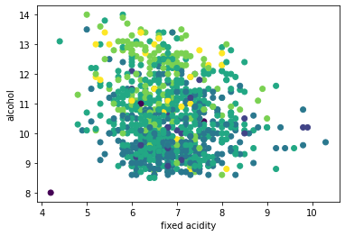
    


#Exe.3

Get x and convert to matrix


```python
X = wine.iloc[:, 0:11]
X = X.values
X
```


    array([[ 7.8 ,  0.28,  0.31, ...,  3.23,  0.64,  9.8 ],
           [ 7.7 ,  0.44,  0.24, ...,  3.12,  0.43, 11.3 ],
           [ 6.15,  0.21,  0.37, ...,  3.39,  0.47, 12.  ],
           ...,
           [ 6.9 ,  0.39,  0.4 , ...,  3.31,  0.37, 12.6 ],
           [ 7.  ,  0.24,  0.34, ...,  3.06,  0.39, 11.9 ],
           [ 6.  ,  0.28,  0.27, ...,  3.27,  0.56, 11.6 ]])


```python
y = wine.iloc[:, 11:12]
y = y.values
```


```python
from keras.utils import to_categorical
y = to_categorical(y)
y
```


    array([[0., 0., 0., ..., 0., 0., 0.],
           [0., 0., 0., ..., 1., 0., 0.],
           [0., 0., 0., ..., 0., 0., 0.],
           ...,
           [0., 0., 0., ..., 0., 0., 0.],
           [0., 0., 0., ..., 0., 0., 0.],
           [0., 0., 0., ..., 0., 0., 0.]], dtype=float32)


#Exe.4


```python
from sklearn.model_selection import train_test_split

trainX, testX, trainy, testy = train_test_split(X,y,test_size=0.2,random_state=0)

print(round(len(trainX)/len(X), 1))
print(round(len(trainy)/len(y), 1))

print(round(len(testX)/len(X), 1))
print(round(len(testy)/len(y), 1))

# get input_shape
print(len(trainX[0]))
print(trainX)
print(trainy)

```

    0.8
    0.8
    0.2
    0.2
    11
    [[ 6.8   0.32  0.43 ...  3.27  0.47 10.7 ]
     [ 6.6   0.17  0.36 ...  3.05  0.54 11.4 ]
     [ 6.8   0.31  0.19 ...  2.83  0.44  9.6 ]
     ...
     [ 7.2   0.28  0.3  ...  3.14  0.5   9.1 ]
     [ 8.    0.18  0.49 ...  3.23  0.48 10.  ]
     [ 6.2   0.27  0.43 ...  3.1   0.51  9.  ]]
    [[0. 0. 0. ... 0. 0. 0.]
     [0. 0. 0. ... 0. 0. 0.]
     [0. 0. 0. ... 0. 0. 0.]
     ...
     [0. 0. 0. ... 0. 0. 0.]
     [0. 0. 0. ... 0. 0. 0.]
     [0. 0. 0. ... 0. 0. 0.]]
    

This is correct

#Exe.5


```python
import tensorflow as tf
from tensorflow import keras
```


```python
model = keras.Sequential([
keras.layers.Flatten(input_shape =(11,)),    
keras.layers.Dense(50, activation ='relu'),                   
keras.layers.Dense(10, activation ='softmax')]) 
```

#Exe.6


```python
from keras . optimizers import SGD

# compile model
lrate = 0.1      # choose a learning rate between 0 and 1 for your test

model.compile(loss='categorical_crossentropy', optimizer = keras.
              optimizers.SGD(learning_rate = lrate), metrics = ['accuracy'])
```

#Exe.7


```python
# fit model
history = model.fit(trainX, trainy, validation_data =(testX, testy), epochs=200, verbose=0)
```

#Exe.8


```python
# plot learning curves
plt.plot(history.history['accuracy'], label ='train', color = 'r')
plt.plot(history.history['val_accuracy'], label ='test', color = 'b')
plt.title('lrate ='+ str (lrate), pad = -50)
```


    Text(0.5, 1.0, 'lrate =0.1')


    
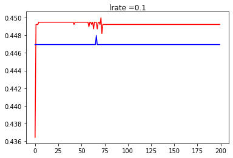
    


#Exe.9


```python
def fit_model(trainX, trainy, testX, testy, lrate):

  model = keras.Sequential([
          keras.layers.Flatten(input_shape =(11,)),    
          keras.layers.Dense(50, activation ='relu'),                   
          keras.layers.Dense(10, activation ='softmax')]) 

  model.compile(loss='categorical_crossentropy', optimizer = keras.
                optimizers.SGD(learning_rate = lrate), metrics = ['accuracy'])
  

  # fit model
  history = model.fit(trainX, trainy, validation_data =(testX, testy), 
                      epochs=200, verbose=0)
  


  # plot learning curves
  plt.plot(history.history['accuracy'], label ='train', color = 'r')
  plt.plot(history.history['val_accuracy'], label ='test', color = 'b')
  plt.title('lrate ='+ str(lrate), pad = -50)

# test
fit_model(trainX, trainy, testX, testy, lrate)


```


    
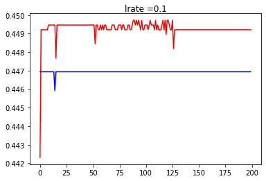
    


#Exe.10


```python
# create learning curves for different learning rates
learning_rates = [1E-0, 1E-1, 1E-2, 1E-3, 1E-4, 1E-5, 1E-6, 1E-7]
for i in range(len(learning_rates)):
  # determine the plot number
  plot_no = 420 + (i+1)
  plt.subplot(plot_no)
  # fit model and plot learning curves for a learning rate
  fit_model (trainX, trainy, testX, testy, learning_rates[i])
  # show learning curves
  plt.show()
```


    
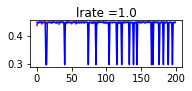
    


    
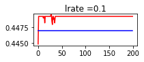
    


    
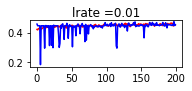
    


    
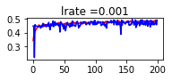
    


    
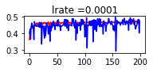
    


    
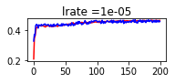
    


    
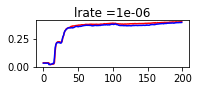
    


    
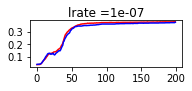
    


Check your results for various learning rate value. 

Which learning rate is more suitable for your model? 

good learning rates : 0.1 / 0.01 / 0.001 / 1e-05

I will choose learning rate = 0.001 because it is stable, it has a good accuracy and validation accuracy


which one is not helpful?

not stable : lrate = 1.0 / 0.0001

bad acc : lrate = 1e-06 / 1e-07


#Exe.11


```python
def fit_model_2(trainX, trainy, testX, testy, momentum):

  my_l_rate = 0.001

  model = keras.Sequential([
          keras.layers.Flatten(input_shape =(11,)),    
          keras.layers.Dense(50, activation ='relu'),                   
          keras.layers.Dense(10, activation ='softmax')]) 

  model.compile(loss='categorical_crossentropy', 
                optimizer = keras.optimizers.SGD(learning_rate=my_l_rate, momentum=momentum), 
                metrics = ['accuracy'])
  

  # fit model
  history = model.fit(trainX, trainy, validation_data =(testX, testy), 
                      epochs=200, verbose=0)
  


  # plot learning curves
  plt.plot(history.history['accuracy'], label ='train', color = 'r')
  plt.plot(history.history['val_accuracy'], label ='test', color = 'b')
  plt.title('momentum ='+ str(momentum), pad = -50)

```

Exe.12


```python
# create momentum curves for different momentum
momentums = [0.0, 0.5, 0.9, 0.99]

for i in range(len(momentums)):

  # determine the plot number
  plot_no = 420 + (i+1)
  plt.subplot(plot_no)

  fit_model_2(trainX, trainy, testX, testy, momentums[i])

  plt.show()
```


    
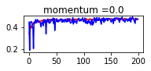
    


    
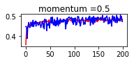
    


    
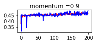
    


    
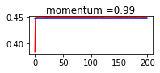
    


Normally, the addition of momentum does accelerate the training of the model.
In all cases where momentum is used, the accuracy of the model on the holdout
test dataset is more stable, showing less volatility over the training epochs. 

How are your results? how do you interpret them?
Best Momentum=0.5 or 0.9

Exe.13


```python
def decay_lrate(initial_rate, decay, iteration):
  return initial_rate * (1.0/(1.0 + decay * iteration))

```


```python
decays = [1E-1, 1E-2, 1E-3, 1E-4]
lrate = 0.01
n_updates = 200

for decay in decays:
  # calculate learning rates for updates
  lrates = [decay_lrate(lrate, decay, i) for i in range(n_updates)]
  # plot result
  plt.plot(lrates, label=str(decay))
  
plt.legend()
plt.show()
```


    
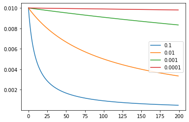
    


```python
def fit_model_3(trainX, trainy, testX, testy, decay):

  my_l_rate = 0.001
  momentum = 0.9

  model = keras.Sequential([
          keras.layers.Flatten(input_shape =(11,)),    
          keras.layers.Dense(50, activation ='relu'),                   
          keras.layers.Dense(10, activation ='softmax')]) 

  model.compile(loss='categorical_crossentropy', 
                optimizer = keras.optimizers.SGD(
                    learning_rate=my_l_rate, momentum=momentum, decay=decay), 
                
                metrics = ['accuracy'])
  

  # fit model
  history = model.fit(trainX, trainy, validation_data =(testX, testy), 
                      epochs=200, verbose=0)
  


  # plot learning curves
  plt.plot(history.history['accuracy'], label ='train', color = 'r')
  plt.plot(history.history['val_accuracy'], label ='test', color = 'b')
  plt.title('decay ='+ str(decay), pad = -50)
```


```python
decays = [1E-1, 1E-2, 1E-3, 1E-4]


for i in range(len(decays)):

  # determine the plot number
  plot_no = 420 + (i+1)
  plt.subplot(plot_no)

  fit_model_3(trainX, trainy, testX, testy, decays[i])

  plt.show()
```


    
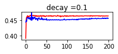
    


    
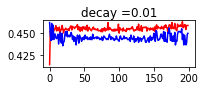
    


    
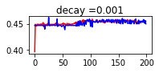
    


    
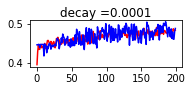
    


Normally, the large decay values decay the learning rate too rapidly for the model on the problem and result in poor performance. The larger decay values do result in better performance. 

How are your results and interpretations?

best decay is 0.001
